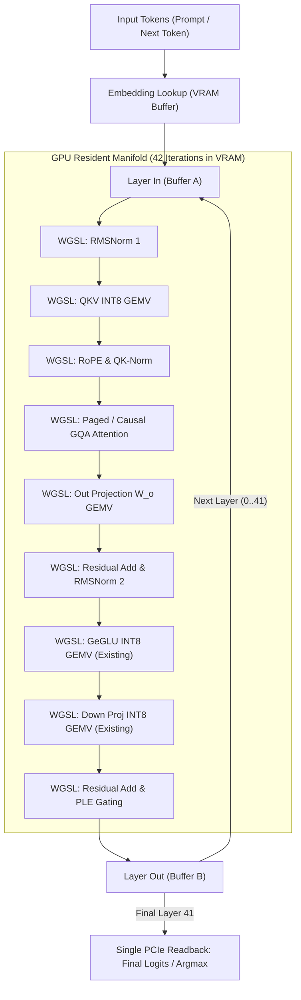

# Implementation Plan: End-to-End WebGPU Forward Pipeline & Batched Prefill Acceleration

**Target**: `src/std/transformer.cl`, `src/std/wgpu.cl`, `test/geomind/chat.cl`  
**Objective**: Eliminate 42 synchronous PCIe host-device roundtrips per token and accelerate batched prompt prefill from 49.3s to < 200 ms.

---

## 1. Problem Analysis & Hardware Profile
- **Current State**:
  - The RTX 2000 Ada has 8 GB VRAM. All 42 INT8 layers (3.73 GB) are already pinned in VRAM storage buffers.
  - However, only GeGLU MLP runs on GPU. Q, K, V projections, GQA Attention, RMSNorm, and PLE gating run on the CPU.
  - Every decoded token executes 42 synchronous PCIe buffer writes (`gpu_write_buffer`) and 42 synchronous blocking PCIe buffer reads (`gpu_read_buffer`).
  - Batched prompt prefill runs 100% on CPU, taking 49.3s for 38 tokens.
- **Target State**:
  - Entire forward pass runs in VRAM GDDR6.
  - Activations ping-pong between two resident buffers (`Buffer_A` and `Buffer_B`) across all 42 layers.
  - Only the final layer-41 hidden state (or final token logits) is mapped back to CPU once per token.
  - Expected decode throughput: **15–25+ tok/s** (15x–20x speedup).
  - Expected prefill latency: **< 200 ms** for prompt prefill.

---

## 2. Technical Architecture & Shader Modules

### Key Subsystems:
1. **WGSL QKV INT8 GEMV Shader**:
   - Computes $Q = X W_q^T$, $K = X W_k^T$, $V = X W_v^T$ using existing `unpack4x8snorm` vector intrinsic.
2. **WGSL Flash-Style Causal GQA Shader**:
   - Parallelizes query heads across workgroups.
   - Attends to resident KV cache buffers directly in VRAM without host roundtrip.
3. **Double-Buffered State Machine**:
   - Pre-allocates two 10 KB activation buffers (`g_trans_gpu_state_ping` and `g_trans_gpu_state_pong`).
   - Single command buffer submitted per token containing all 42 dispatches with pipeline execution barriers.
4. **Batched Prefill Compute Kernel**:
   - Dispatches $N$-token matrix-matrix multiplication (`GEMM`) on GPU instead of row-outer CPU loop.

---

## 3. Verification & Acceptance Criteria
- [ ] 38-token prefill latency drops from 49.3s to < 0.5s.
- [ ] Decode generation throughput exceeds 15.0 tok/s on NVIDIA RTX 2000 Ada.
- [ ] Bit-level or high-cosine agreement with CPU AVX2 reference (cosine similarity $\ge 0.999$).
- [ ] Zero regression across compiler regression suite (Targets 58, 83, 84, 85, 86).
