# Implementation Plan: Indexed Vector Retrieval & Compiler 64-Bit Pointer Type Safety

**Target**: `src/std/sqlite_vec.cl`, `test/geomind/chat.cl`, `src/cartanc/type_checker.car`, `src/cartanc/llvm_codegen.car`  
**Objective**: Replace $O(N)$ linear scans in biometrics/episodic memory with indexed spatial retrieval, and formalize 64-bit integer pointer types to eliminate IEEE-754 float precision hazards.

---

## 1. Problem Analysis & Technical Deficiencies

### A. Linear Brute-Force Vector Scans
- In `test/geomind/chat.cl` and `src/std/vision.cl`, facial verification and episodic attractor retrieval iterate through every registered record sequentially:
  ```cartan
  while (u < user_count) {
      let sim = vision_cosine_similarity(live_emb, u_emb, 320.0);
      ...
  }
  ```
- While adequate for small user sets, this brute-force approach scales poorly as episodic memory expands to thousands of recorded interaction turns and concept basins.

### B. Pointer / Float Conflation
- CARTAN currently treats pointers in high-level structures as `float` (e.g. `cartan_tree_get_f32`, `cartan_f32_at`).
- IEEE-754 double precision floats only guarantee 53 bits of exact integer precision. Memory allocations spanning very large virtual memory segments (> 9 PB or addresses with high bits set) risk catastrophic pointer truncation.

---

## 2. Technical Architecture

```mermaid
flowchart TD
    subgraph Vector_Indexing ["Indexed Vector Retrieval Architecture"]
        QueryVec["Live Query Embedding (320-D / 248-D)"] --> HopfieldPre["Continuous Hopfield Coarse Basin Filter (Top-K Clusters)"]
        HopfieldPre --> CandidateSubset["Pruned Candidate Cluster (K << N)"]
        CandidateSubset --> ExactCosine["Fine Eikonal / Manifold Metric Evaluation"]
        ExactCosine --> TopResult["Matched Identity / Semantic Attractor"]
    end

    subgraph Type_Safety ["Compiler 64-Bit Pointer Safety Pipeline"]
        AST_Node["AST Pointer Expr"] --> TC["Type Checker: Strict 'ptr' / 'u64' Type Enactment"]
        TC --> Codegen["llvm_codegen: Emit i64 / ptr LLVM Types (Zero F64 Bitcast)"]
        Codegen --> Runtime["Pure 64-bit Memory Addressing"]
    end
```



### Key Subsystems:
1. **Hierarchical Manifold Vector Indexing (`src/std/sqlite_vec.cl`)**:
   - Organize episodic memory and face biometric embeddings into Continuous Hopfield cluster centroids.
   - Querying performs a 2-stage search:
     1. Stage 1: Coarse dot product against $C$ cluster centroids to identify the active basin.
     2. Stage 2: Fine-grained cosine evaluation exclusively within the winning basin.
   - Reduces search complexity from $O(N)$ to $O(\sqrt{N})$.
2. **First-Class 64-Bit Pointer Types (`src/cartanc/`)**:
   - Enforce distinct `ptr` / `u64` primitive type representation in `type_checker.car`.
   - Update `llvm_codegen.car` to emit LLVM `ptr` or `i64` natively for all memory operations without intermediate `fptoui` / `uitofp` casting.
   - Add compiler regression target verifying exact 64-bit pointer arithmetic beyond the 53-bit float threshold.

---

## 3. Verification & Acceptance Criteria
- [ ] Biometric and episodic search latency scales sub-linearly with cluster pre-filtering.
- [ ] Type checker validates pointer expressions without implicit float conversions.
- [ ] All 88 regression test suite targets pass with 100% compliance.
