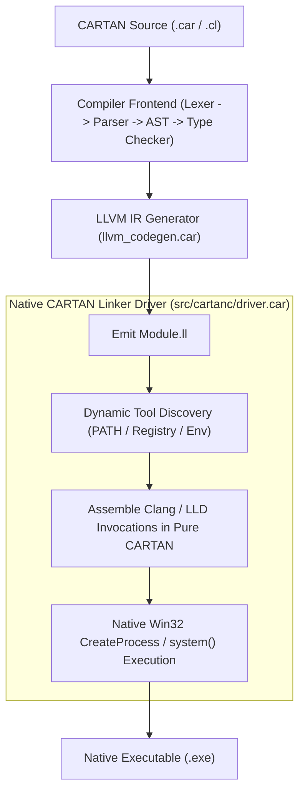

# Implementation Plan: Native Standalone Compiler Driver (Zero-Python Toolchain)

**Target**: `src/cartanc/main.car`, `tools/zig_wrapper.py`, `src/cartanc/core_runtime.car`  
**Objective**: Eliminate the external Python wrapper (`tools/zig_wrapper.py`), remove hardcoded Intel oneAPI/CUDA paths, and achieve a 100% self-contained standalone compiler binary.

---

## 1. Problem Analysis & Current State
- `cartanc.exe` builds native executables by executing:
  ```cartan
  let zig_cmd = cartan_string_concat("python tools/zig_wrapper.py ", out_ll);
  let cmd = cartan_string_concat(cartan_string_concat(zig_cmd, " -o "), output_file);
  let compile_res = system(cmd);
  ```
- `tools/zig_wrapper.py` is a Python script that hardcodes absolute paths:
  - `C:\Program Files (x86)\Intel\oneAPI\2025.3\bin\compiler\clang.exe`
  - `C:\Program Files\NVIDIA GPU Computing Toolkit\CUDA\v13.2\lib\x64`
  - `C:\Program Files (x86)\Intel\oneAPI\2025.3\lib`
  - `C:\Users\rich-\source\repos\CARTAN\lib`
- **Violations**:
  1. Two-language problem: A C/Python runtime dependency in what is specified to be a standalone, self-compiling programming language.
  2. Portability defect: If Intel oneAPI is installed in a different directory or machine, compilation fails.
  3. Performance overhead: Spawning `python.exe` on every `cartanc.exe build` adds ~200–400 ms of process startup latency per test target.

---

## 2. Technical Architecture & Native Driver Design



### Key Subsystems:
1. **Dynamic Toolchain Discovery (`cartan_resolve_toolchain`)**:
   - Checks `CARTAN_CLANG` environment variable first.
   - Searches `PATH` for `clang.exe` and `lld-link.exe`.
   - Probes canonical installation directories:
     - `%ONEAPI_ROOT%\compiler\latest\bin\clang.exe`
     - `%ProgramFiles%\LLVM\bin\clang.exe`
     - `%ProgramFiles(x86)%\Microsoft Visual Studio\...\bin\Hostx64\x64\link.exe`
2. **Direct Command Assembly in CARTAN**:
   - Re-implements `zig_wrapper.py` argument translation logic directly in `src/cartanc/main.car`.
   - Inlines flags: `-target x86_64-pc-windows-msvc -O2 -mavx2 -mfma -Wl,/FORCE:MULTIPLE -Wl,/STACK:67108864`.
   - Resolves library search paths dynamically relative to `cartanc.exe` (`./lib/`, `../lib/`).
3. **Compiler Frontend Hygiene**:
   - Remove noisy `printf("[DEBUG include] raw_path=%s\n", path);` from `src/cartanc/main.car`.
4. **Deprecate `tools/zig_wrapper.py`**:
   - Retain solely as a legacy fallback until 3-stage bootstrap fixpoint convergence verifies the native driver.

---

## 3. Verification & Acceptance Criteria
- [ ] `cartanc.exe` compiles any target without invoking `python.exe`.
- [ ] 3-stage self-hosting bootstrap (`cartanc.exe -> stage1 -> stage2 -> stage3`) succeeds with bit-for-bit SHA-256 fixpoint parity.
- [ ] Build latency per test target drops by 200–300 ms across the 88 regression targets.
- [ ] All 88 compiler regression tests pass with clean exit code 0.
