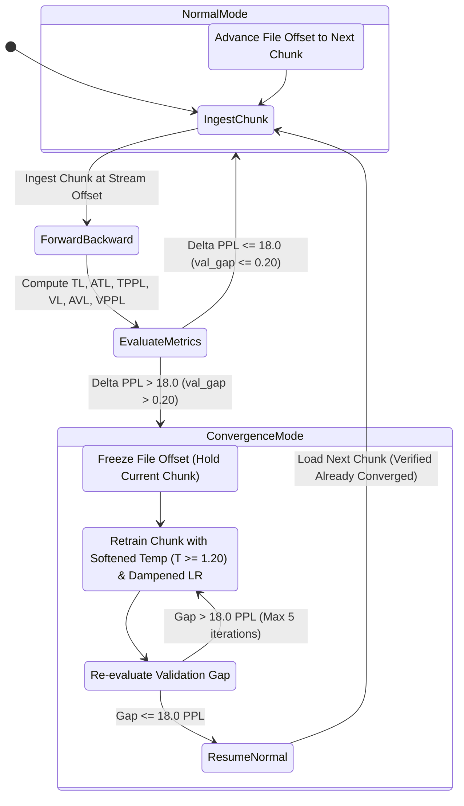

# Test Plan: Interleaved Training & Closed-Loop Chunk Convergence Gate

## 1. Executive Summary & Objective
This test plan evaluates two complementary mechanisms to eliminate generalization divergence in GeoMind Stage 2 Causal Cross-Entropy pretraining:
1. **Multi-Domain Interleaved Streaming**: Replacing monolithic single-dataset streaming (37 MB FineWeb block) with balanced round-robin rotation across domains (FineWeb $\leftrightarrow$ Syntactic Cloze $\leftrightarrow$ OpenWebText $\leftrightarrow$ WikiText $\leftrightarrow$ Narrative Stories) to prevent single-domain specialization drift.
2. **Closed-Loop Chunk Convergence Gate**: A state-machine controller that monitors the generalization gap ($\Delta PPL = VPPL - TPPL$). If $\Delta PPL \le 18.0$ ($val\_gap \le 0.20\text{ nats}$), training proceeds normally. If $\Delta PPL > 18.0$, the engine enters **Convergence Mode**: chunk offset advancement is suspended, and the current chunk is retrained with high-gain temperature softening ($T \approx 1.20 - 1.30$) and dampened LR until $VPPL$ converges and the gap contracts below threshold. Advancing to the next chunk only occurs once the model is verified in a converged state.

---

## 2. Theoretical Architecture & State Machine

### Key Equations & Parameters
1. **Generalization Gap Metric**:
   $$val\_gap = AVL - ATL = \ln(VPPL) - \ln(TPPL)$$
2. **Normal Mode Activation Bound**:
   $$val\_gap \le 0.18\text{ nats} \iff \Delta PPL \le 18.0\text{ PPL}$$
3. **Convergence Mode Action**:
   - Offset advancement suspended: `cur_offset` held constant.
   - Temperature elevated to high softening band: $T \in [1.20, 1.35]$.
   - Learning rate damped: $LR_{\text{conv}} = LR \times 0.85$.
   - Chunk re-processed up to $K = 5$ iterations or until $val\_gap \le 0.18$.
   - If converged, resume stream: verify next chunk arrives with $VPPL$ already aligned.

---

## 3. Curriculum Interleaving Design

Instead of processing 37 MB of `fineweb_edu_curated.txt` before touching any other dataset, the curriculum manifest rotates every $N = 200$ chunks (51,200 tokens) across the 5 canonical foundation registers:
1. **Educational Web Prose**: `fineweb_edu_curated.txt` (200 chunks)
2. **Syntactic Cloze Scaffolding**: `mined_expanded_corpus_cloze_part01.txt` (200 chunks)
3. **General Discourse & Dialogue**: `openwebtext_curated.txt` (200 chunks)
4. **Encyclopedic Structural Syntax**: `wikitext103_structural.txt` (200 chunks)
5. **Narrative & Fiction**: `storytelling_corpus_clean.txt` (200 chunks)

This maintains equal representation of all 4 holdout registers in the cortical weights throughout training, eliminating domain starvation.

---

## 4. Test Protocol & Verification Criteria

### Phase 1: Baseline Restoration
1. Copy verified clean SLERP weights from [`geomind_slerp_fused_weights.bin`](file:///C:/Users/rich-/source/repos/CARTAN/test/geomind/trainingdata/checkpoints/geomind_slerp_fused_weights.bin) over [`geomind_steady_state_weights.bin`](file:///C:/Users/rich-/source/repos/CARTAN/test/geomind/trainingdata/checkpoints/geomind_steady_state_weights.bin).
2. Execute `--eval-analogy` to verify 4/4 analogies at Rank 1 (+0.10 to +0.27 margins).
3. Execute `--train-cloze` (Stage 1) to converge cloze scaffolding ($ATL \approx 3.76, AVL \approx 3.59, VPPL \approx 36.4$).

### Phase 2: Engine Implementation
1. Add `g_conv_mode_active` and chunk-repeat loop in `geomind_train_streaming_steady_state` in [`test/geomind/train.cl`](file:///C:/Users/rich-/source/repos/CARTAN/test/geomind/train.cl).
2. Recompile with `cartanc.exe` and synchronize binaries across all 3 paths.

### Phase 3: Empirical Evaluation
1. Run Stage 2 Causal CE pretraining.
2. Verify telemetry:
   - When gap exceeds $18\text{ PPL}$, log confirms: `[Convergence Mode] Holding chunk at offset X until VPPL aligns`.
   - Once gap contracts, log confirms: `[Normal Mode] Resuming stream; next chunk VPPL aligned`.
   - Measure whether $VPPL$ stays bounded ($\le 60\text{ PPL}$) instead of climbing to $108+$.
