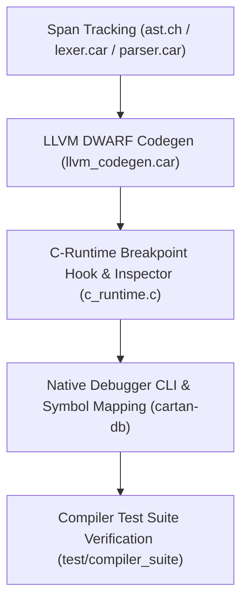

# Sprint 2 Implementation Plan: CARTAN Native Debugger (`cartan-db`) & Toolchain Enhancements

## Goal
Implement a native debugging toolchain for the CARTAN language (`cartan-db`), including AST line-span propagation, LLVM DWARF debug metadata emission (`!dbg`), runtime breakpoint hooks (`dbg!`), and an interactive source-level variable inspector.

---

## Technical Architecture & Dependency Tree

### 1. `Span` & Source Location Preservation
- **Component**: `src/cartanc/ast.ch`, `src/cartanc/lexer.car`, `src/cartanc/parser.car`
- **Logic**: Ensure every AST node (`Stmt`, `Expr`) retains filename, line number, and column span metadata.

### 2. LLVM IR DWARF Debug Metadata Generator
- **Component**: `src/cartanc/llvm_codegen.car`
- **Logic**:
  - Emit `!llvm.dbg.cu` compile unit descriptor.
  - Emit `DISubprogram` metadata for function declarations.
  - Attach `!dbg !<location_id>` metadata tags to LLVM instruction lines corresponding to `.car` source lines.
  - Enable native GDB / LLDB / MSVC stepping directly in CARTAN `.car` source files.

### 3. Native CARTAN Interactive Debug Hook (`dbg!` / `cartan_debug_break`)
- **Component**: `src/cartanc/c_runtime.c` & `src/cartanc/parser.car`
- **Logic**:
  - Implement `@breakpoint` / `dbg!` statement in syntax.
  - In `c_runtime.c`, implement interactive REPL prompt on breakpoint trigger printing line number, local variable values, and tensor shapes.

### 4. `cartan-db` Standalone CLI Driver
- **Component**: `src/cartandb/main.car` / `utils/cartan-db`
- **Logic**:
  - CLI wrapper tool to build target `.car` files with `-g` (debug symbols) and launch interactive execution session.

---

## User Rules & Governance Compliance
- **Low-Entropy Architecture**: Integrates directly into existing LLVM codegen without external heavy dependencies.
- ** empirical QA**: Automated test cases in `test/compiler_suite/test_debug.car` verifying line metadata generation and breakpoint triggers.
- **Documentation**: Update `LANGUAGE_REFERENCE.md`, `README.md`, and `CHANGELOG.md`.
