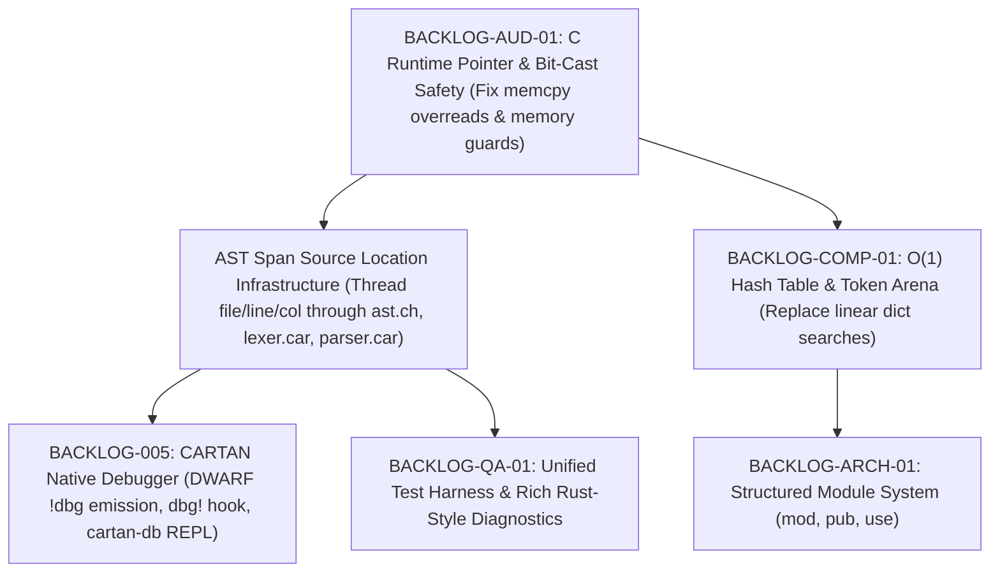

# Sprint 2 Prioritization Plan & Dependency Matrix

## Executive Summary & Critical Path Analysis

The subagent team analyzed cross-cutting dependencies across all backlog items. We identified **`BACKLOG-AUD-01` (C Runtime Safety & Bit-Cast Fixes)** and **AST `Span` Infrastructure** as the fundamental root-cause prerequisites that unlock both compiler performance (`BACKLOG-COMP-01`) and the native debugger (`BACKLOG-005`).

---

## 1. Logical Dependency Tree

---

## 2. Priority Rationale & Criticality Breakdown

### 🔴 Critical (Must Do First — Foundation & Safety)
1. **`BACKLOG-AUD-01` — C Runtime Safety & Bit-Cast Overread Fix**:
   - **Why Critical**: `enum_get_double` currently executes `memcpy(&f, &val_32, sizeof(double))` where `val_32` is a 32-bit uint, causing stack overreads. Building a debugger or module system on top of a runtime with memory corruption will cause downstream tools to inspect garbage or crash.
   - **Effect**: Guarantees deterministic, memory-safe runtime execution for all compiler passes.

2. **AST `Span` Source Location Propagation**:
   - **Why Critical**: Both the Native Debugger (`BACKLOG-005`) and Rich Diagnostics (`BACKLOG-QA-01`) depend 100% on AST nodes knowing their exact file, line, and column. Threading `Span` ONCE through `ast.ch`, `lexer.car`, and `parser.car` resolves the underlying requirement for BOTH features simultaneously.

---

### 🟡 High Value (Sprint 2 Core Targets — Feature & Performance)
3. **`BACKLOG-005` — CARTAN Native Debugger (`cartan-db` & DWARF Metadata)**:
   - **Why High Value**: Once `Span` metadata and runtime safety are solid, emitting LLVM IR `!dbg` tags and `@breakpoint` REPL prompts gives CARTAN developers direct source-level stepping in LLDB / GDB / VSCode, making all future debugging 10x faster.

4. **`BACKLOG-COMP-01` — $O(1)$ Hash Table Symbol Resolution**:
   - **Why High Value**: `type_checker.car` and `llvm_codegen.car` currently use $O(N)$ linear tree searches (`cartan_dict_get`/`set`). Converting this to an $O(1)$ hash map prevents exponential compilation slowdowns as AST sizes grow.

---

### 🟢 Medium Priority (Follow-up Sprints — Scale & Ergonomics)
5. **`BACKLOG-QA-01` — Unified Test Harness (`cartan test`)**:
   - Leverages `Span` diagnostics and snapshot matching to enforce regression-free compiler releases.
6. **`BACKLOG-ARCH-01` — Structured Module System (`mod`, `pub`, `use`)**:
   - Leverages $O(1)$ symbol resolution to compile multi-file standard library modules cleanly.

---

## 3. Recommended Execution Order for Sprint 2

1. **Step 1 (Runtime Audit)**: Fix 32-bit `memcpy` bit-cast in `c_runtime.c` and add allocation guards.
2. **Step 2 (AST `Span` Plumbing)**: Thread line/column `Span` metadata through `ast.ch`, `lexer.car`, and `parser.car`.
3. **Step 3 (LLVM DWARF & Breakpoints)**: Implement DWARF `!dbg` IR metadata generation in `llvm_codegen.car` and `@breakpoint` hook in `c_runtime.c`.
4. **Step 4 (`cartan-db` Driver & REPL)**: Build the interactive debugger CLI driver in `src/cartandb/main.car`.
5. **Step 5 ($O(1)$ Symbol Table)**: Upgrade `cartan_dict` to an $O(1)$ hash table in `c_runtime.c`.
