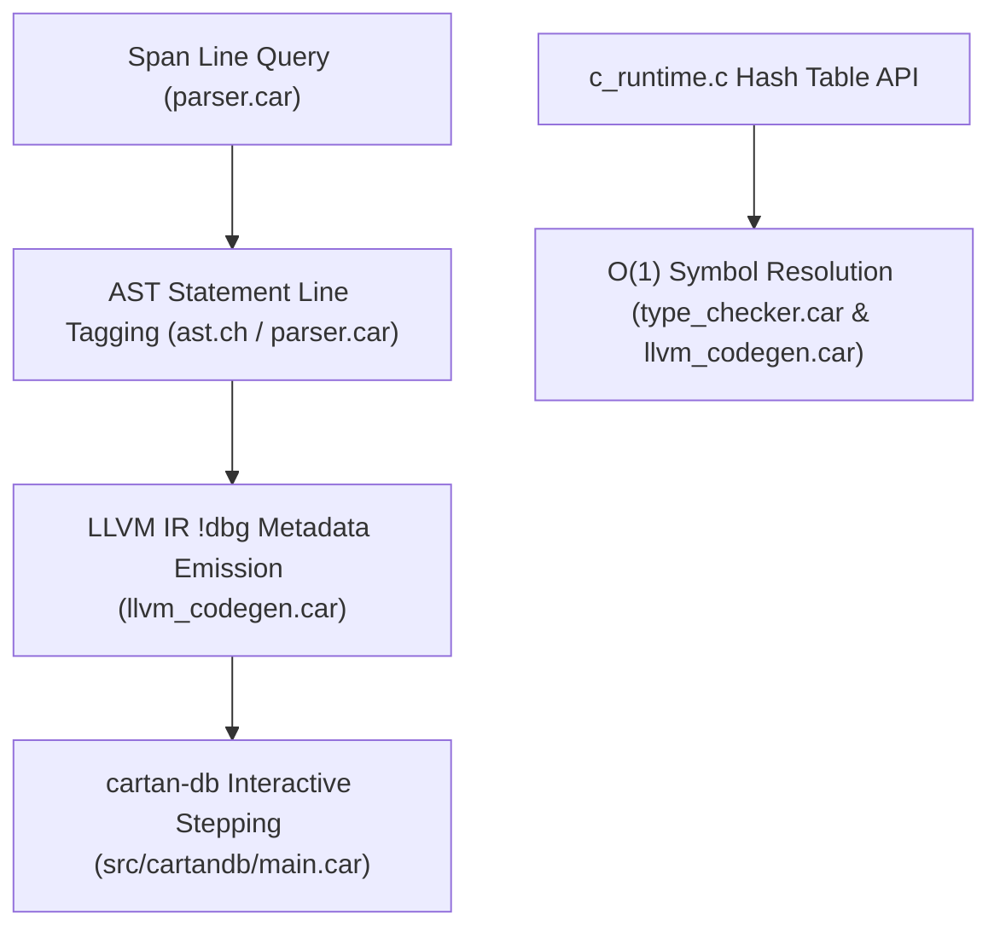

# Sprint 3 Implementation Plan: AST DWARF Line Emission (`!dbg`) & $O(1)$ Compiler Hash Table

## Goal
Execute Sprint 3 deliverables:
1. Complete AST statement line-tagging and emit LLVM DWARF `!dbg` metadata lines in `llvm_codegen.car` (`BACKLOG-005`).
2. Replace linear $O(N)$ symbol searches in `c_runtime.c` with an $O(1)$ string-interned hash map (`BACKLOG-COMP-01`).
3. Build the automated compiler test suite runner in `test/compiler_suite/` (`BACKLOG-QA-01`).

---

## Technical Architecture & Dependency Tree

---

## Deliverables & Component Breakdown

### 1. AST Line Tagging & DWARF `!dbg` IR Emission (`BACKLOG-005`)
- **Components**: `src/cartanc/ast.ch`, `src/cartanc/parser.car`, `src/cartanc/llvm_codegen.car`
- **Logic**:
  - Store `line: float` on AST statement nodes when created in `parser.car`.
  - In `llvm_codegen.car`, emit DWARF `!dbg !<line_id>` metadata tags on instructions and output compile unit descriptors.

### 2. $O(1)$ String-Interned Hash Table Symbol Table (`BACKLOG-COMP-01`)
- **Components**: `src/cartanc/c_runtime.c`, `src/cartanc/type_checker.car`, `src/cartanc/llvm_codegen.car`
- **Logic**:
  - Implement a FNV-1a string hash table in `c_runtime.c` for `cartan_dict_get`/`set` to replace $O(N)$ list traversals with $O(1)$ bucket lookups.

### 3. Unified Automated Regression Suite (`BACKLOG-QA-01`)
- **Components**: `test/compiler_suite/` & `test/compiler_suite/run_tests.car`
- **Logic**:
  - Create test cases verifying primitives, structs, enum payload extraction, borrow types, and breakpoints under `cartanc.exe`.
