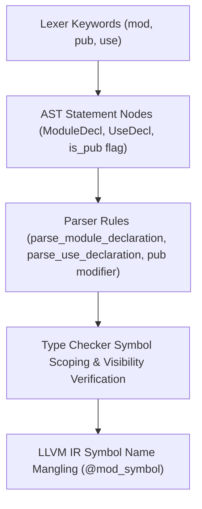

# Sprint 4 Implementation Plan: `BACKLOG-ARCH-01` Structured Module System (`mod`, `pub`, `use`)

## Goal
Implement native module scoping, symbol export visibility (`pub`), and module path imports (`use`) across the CARTAN compiler pipeline (`ast.ch`, `lexer.car`, `parser.car`, `type_checker.car`, and `llvm_codegen.car`).

---

## Technical Architecture & Dependency Tree

---

## Deliverables & Component Breakdown

### 1. Lexer & AST Extensions (`ast.ch`, `lexer.car`)
- Verify `TokenType::Mod`, `TokenType::Pub`, `TokenType::Use` in `ast.ch` and `lexer.car`.
- Add `Stmt::ModuleDecl(string)` (disc 80.0) and `Stmt::UseDecl(string)` (disc 81.0) enum variants in `ast.ch`.

### 2. Parser Module Scoping & Visibility (`parser.car`)
- Add `parse_module_declaration(self_ptr)` handling `mod name;`.
- Add `parse_use_declaration(self_ptr)` handling `use path::symbol;`.
- Intercept `pub` keyword prefix in `declaration(self_ptr)` to set `is_pub: 1.0` on exported functions, structs, and variables.

### 3. Type Checker & Symbol Name Mangling (`type_checker.car`, `llvm_codegen.car`)
- Qualify public module symbols as `mod_name::symbol` in symbol tables.
- Mangle exported function names in LLVM IR as `@mod_name_symbol`.

---

## Verification Plan
- Build multi-file module test case in `test/compiler_suite/test_modules.car`.
- Verify compilation with `cartanc.exe`.
