# SPRINT 66 IMPLEMENTATION PLAN: PHASE 16 WORDNET/SLANGNET & AUTHENTIC 32K VOCABULARY ENGINE

## 1. Overview & Objectives
This plan outlines the execution of **Phase 16** (`[BACKLOG-WORDNET-01]` and `[BACKLOG-VOCAB-01]`), integrating Old GeoMind's WordNet/SlangNet hypernym tree taxonomy, Information Content (IC) token weight loss scaling, Top-K Hierarchy Distillation loss, and authentic 32k HuggingFace vocabulary matrix binding directly into CARTAN's standard library.

---

## 2. Sprint Tasks & Deliverables

```mermaid
graph TD
    subgraph Task 1: Semantics & Tree Module
        S1[Create src/std/semantics.car] --> S2[Implement WordNet & SlangNet Dot-Path Tree Parser]
        S2 --> S3[Implement On-The-Fly LCA Depth Calculator]
    end

    subgraph Task 2: Information Content & Tokenizer
        T1[Update src/std/tokenizer.car] --> T2[Load & Map Token IC Weights geomind_ics]
        T2 --> T3[Add SIMD Fused IC-Loss Scaling Kernel]
    end

    subgraph Task 3: Top-K Hierarchy Loss
        D1[Update src/std/distill.car] --> D2[Implement Sparse Top-128 Hierarchy Penalty]
    end

    subgraph Task 4: Authentic 32k Vocab Binding
        H1[Update src/std/hub.car & c_runtime.c] --> H2[Bind Official HuggingFace 32k/256k tokenizer.json]
        H2 --> H3[Zero-Copy embed_tokens.weight Matrix Access]
    end
```

### Task 1: Native Semantic Taxonomy Module (`src/std/semantics.car`)
- Create `src/std/semantics.car` for parsing dot-notation hypernym paths (`entity.physical_entity.object...`).
- Implement Lowest Common Ancestor (LCA) tree depth calculation using 32-bit pre-hashed synset integer arrays for $O(1)$ tree distance resolution.

### Task 2: Information Content Loss Engine (`src/std/tokenizer.car` & `src/cartanc/c_runtime.c`)
- Add `cartan_tree_get_ic_weight(token_id)` in `src/std/tokenizer.car` to load token Information Content $IC(t) = -\log P(t)$.
- Fuse IC token weights directly into cross-entropy loss gradient loops: $\text{grad}_i = IC[t_i] \cdot (\hat{y}_i - y_i)$, prioritizing domain words (`thermodynamics`, `algorithm`) over stop-words (`the`, `and`).

### Task 3: Sparse Top-K Hierarchy Proximity Loss (`src/std/distill.car`)
- Implement `distill_hierarchy_loss(tree_distance, manifold_distance)` in `src/std/distill.car`.
- Enforce the Top-128 sparse logit candidate constraint recommended by the Runtime Engineer, keeping working set size $< 1\text{ MB}$ and eliminating dynamic memory allocations.

### Task 4: Authentic 32,000 / 256,000 Token Vocabulary Binding (`src/std/hub.car`)
- Update `hub_load_tokenizer` in `src/std/hub.car` to ingest official HuggingFace `tokenizer.json` files directly.
- Bind string tokens to `model.embed_tokens.weight` matrix rows (`[32000 x 4096]`), eliminating artificial shortcuts and enabling native E8 manifold vocabulary training.

---

## 3. Empirical QA & Regression Verification
- Run compiler regression suite `test/compiler_suite/run_tests.car` (target `[41/41]`).
- Run GeoMind SFT training pass `geomind.exe --train-sft` on `multi_domain_corpus.txt`.
- Run interactive dialogue verification `geomind.exe --chat` across astronomy, physics, code, math, and dialogue prompts.
- Maintain entries in `CHANGELOG.md` and archive files in `docs/archive/`.
