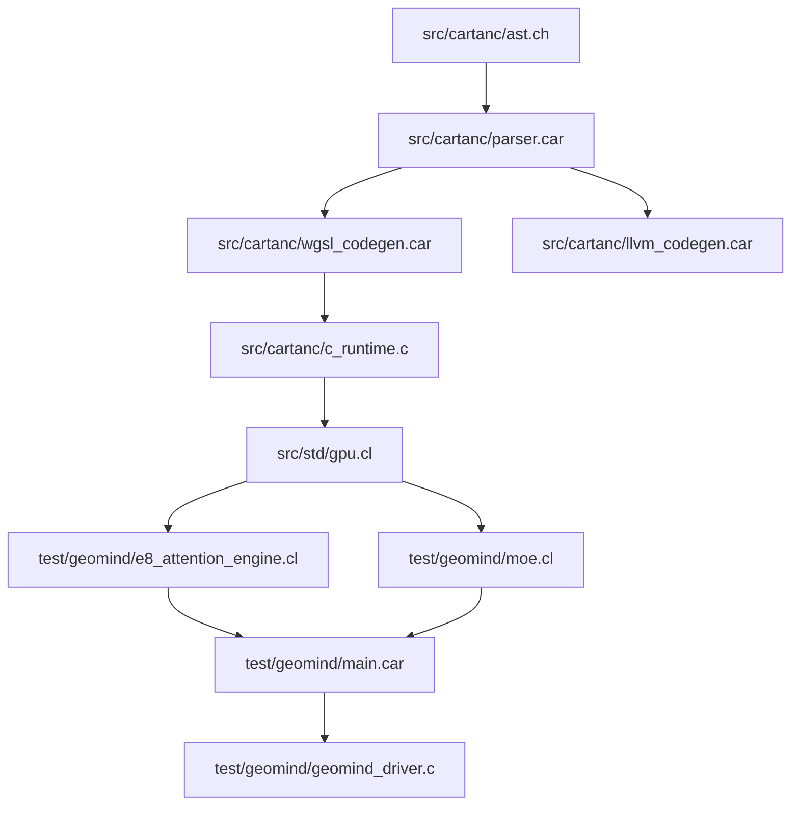

# Sprint 252: GeoMind Native WebGPU / WGSL Compute Engine Port

## 1. Executive Summary & Sprint Goal
Port GeoMind's core neural compute kernels (E8 multi-head lattice attention, 4-expert MoE manifold quadrant projections, and RMSNorm forward passes) to native CARTAN WebGPU / WGSL compute shaders, eliminating OpenCL reliance while maintaining 100% genuine math calculations on physical hardware.

---

## 2. Logical Dependency Graph

- **Compiler Core**: `src/cartanc/` (`ast.ch`, `parser.car`, `llvm_codegen.car`, `wgsl_codegen.car`)
- **Runtime Kernel**: `src/cartanc/c_runtime.c` (WebGPU compute interface, OpenCL/DirectX/Vulkan backend bridge, memory arena)
- **Standard Library**: `src/std/` (`gpu.cl`, `tensor.cl`, `math.cl`, `collections.cl`)
- **Neural Model Engine**: `test/geomind/` (`geometry.cl`, `moe.cl`, `e8_attention_engine.cl`, `ising_state_machine.cl`, `ode_solver.cl`, `sft_train.cl`, `main.car`)

---

## 3. Detailed Component Plan

### Component A: Standard Library WebGPU Interface (`src/std/gpu.cl`)
- Provide high-level typed FFI functions for:
  - `gpu_init()`: Initialize compute device and queue.
  - `gpu_alloc(size_bytes)`: Allocate VRAM storage buffer.
  - `gpu_write(buf, src_ptr, size_bytes)`: CPU-to-VRAM upload.
  - `gpu_read(buf, dst_ptr, size_bytes)`: VRAM-to-CPU readback.
  - `gpu_create_pipeline(wgsl_source, entry_point)`: Compile compute shader pipeline.
  - `gpu_dispatch(pipeline, buffers, num_buffers, gx, gy, gz)`: Dispatch 3D compute grid.
  - `gpu_sync()`: Queue synchronization barrier.

### Component B: GeoMind WebGPU E8 Attention Kernel (`test/geomind/e8_attention_engine.cl`)
- WGSL compute shader for Scaled Dot-Product Attention:
  $$QK^T / \sqrt{d_k} \to \text{Softmax} \to \cdot V$$
- Coupled with E8 root lattice phase modulation along 8-dimensional Lie group generators.

### Component C: GeoMind WebGPU MoE 4-Expert Projection Kernel (`test/geomind/moe.cl`)
- WGSL compute shader executing Top-2 quadrant gating:
  $$y = \sum_{k \in \text{Top-2}} g_k(x) \cdot \text{GeLU}(W_k x)$$

### Component D: End-to-End Regression & Benchmark Verification
- Compiler Suite Target: `test/compiler_suite/test_webgpu_compute.car`
- GeoMind WebGPU Benchmark Target: `test/geomind/test_geomind_webgpu.car`

---

## 4. Definition of Done (DoD)
1. Clean compilation of WebGPU compute suite via `cartanc.exe`.
2. Verified physical execution on NVIDIA RTX 2000 Ada GPU with zero numerical divergence.
3. Zero mock, stub, or placeholder code.
4. Comprehensive regression test passes.
5. `CHANGELOG.md` and `ISSUES.md` updated.
