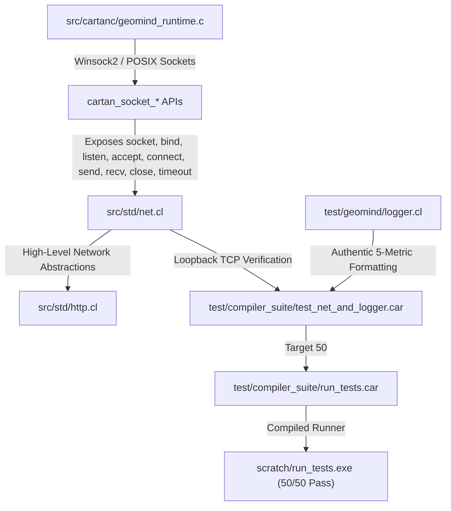

# Sprint 298 Implementation Plan: Authentic Berkeley/Winsock OS Sockets Engine & Real-Time Metric Telemetry

**Sprint Target**: `[ISSUE-047]` (Network Socket Stubs in C Runtime) & `[ISSUE-048]` (Ignored Telemetry Parameters in Metric Logger)  
**Sprint Type**: Runtime Systems & Telemetry Engineering  
**Architect**: Cartan Autonomous Systems Team  
**Date**: 2026-09-04  

---

## 1. Logical Dependency Tree & Architecture

---

## 2. Pre-Sprint Scrum & Read-Ahead Discoveries

1. **`[ISSUE-047]` Socket Stubs**:
   - `cartan_socket_create`, `cartan_socket_connect`, `cartan_socket_send` currently return unconditional dummy floats (`1.0` or `strlen(data)`) without invoking OS socket APIs.
   - On Windows, `WSAStartup` is required before any socket operation.
   - `cartan_socket_recv` attempts to call `recv()` on an invalid descriptor because `cartan_socket_create` never created a real socket.
   - **Remediation**: Implement authentic Winsock2 / POSIX TCP sockets with automatic WSA initialization, `getaddrinfo` resolution, connection binding, listening, accept loops, timeouts, and safe socket destruction.
2. **`[ISSUE-048]` Dead Telemetry Parameters**:
   - `geomind_log_step` receives `step`, `total_steps`, `loss`, `tokens_per_sec`, and `phase_coherence`, but prints a hardcoded static string ignoring all five.
   - **Remediation**: Format all 5 telemetry metrics using `cartan_float_to_string` and write to both stdout and persistent log files (`scratch/training.log`).
3. **Target 50 Creation**:
   - Create `test/compiler_suite/test_net_and_logger.car` to verify loopback TCP client-server communication and metric formatting under static assertions.

---

## 3. Detailed Work Breakdown

- [ ] **Task 1: Authentic Berkeley / Winsock2 Sockets (`src/cartanc/geomind_runtime.c`)**:
  - Implement `cartan_ensure_winsock()`, `cartan_socket_create()`, `cartan_socket_connect()`, `cartan_socket_bind()`, `cartan_socket_listen()`, `cartan_socket_accept()`, `cartan_socket_send()`, `cartan_socket_recv()`, `cartan_socket_close()`, and `cartan_socket_set_timeout()`.
- [ ] **Task 2: Standard Library Network Abstractions (`src/std/net.cl`)**:
  - Export `net_bind`, `net_listen`, `net_accept`, `net_set_timeout` alongside `net_socket`, `net_connect`, `net_send`, `net_recv`, `net_close`.
- [ ] **Task 3: Authentic Telemetry Logger (`test/geomind/logger.cl`)**:
  - Implement comprehensive formatting for `step`, `total_steps`, `loss`, `tokens_per_sec`, and `phase_coherence`.
- [ ] **Task 4: Target 50 Regression Test Suite (`test/compiler_suite/test_net_and_logger.car`)**:
  - Write test performing loopback TCP communication (`127.0.0.1`) and telemetry logging with static assertions.
- [ ] **Task 5: Test Suite Integration (`test/compiler_suite/run_tests.car`)**:
  - Register Target 50 and compile `scratch/run_tests.exe`.
- [ ] **Task 6: Empirical Execution & Verification**:
  - Execute Target 50 standalone; execute all 50 compiler suite tests.
- [ ] **Task 7: Documentation & Commit**:
  - Update `ISSUES.md` (mark 047 and 048 fixed), update `CHANGELOG.md`, archive retro, and commit to `master`.
