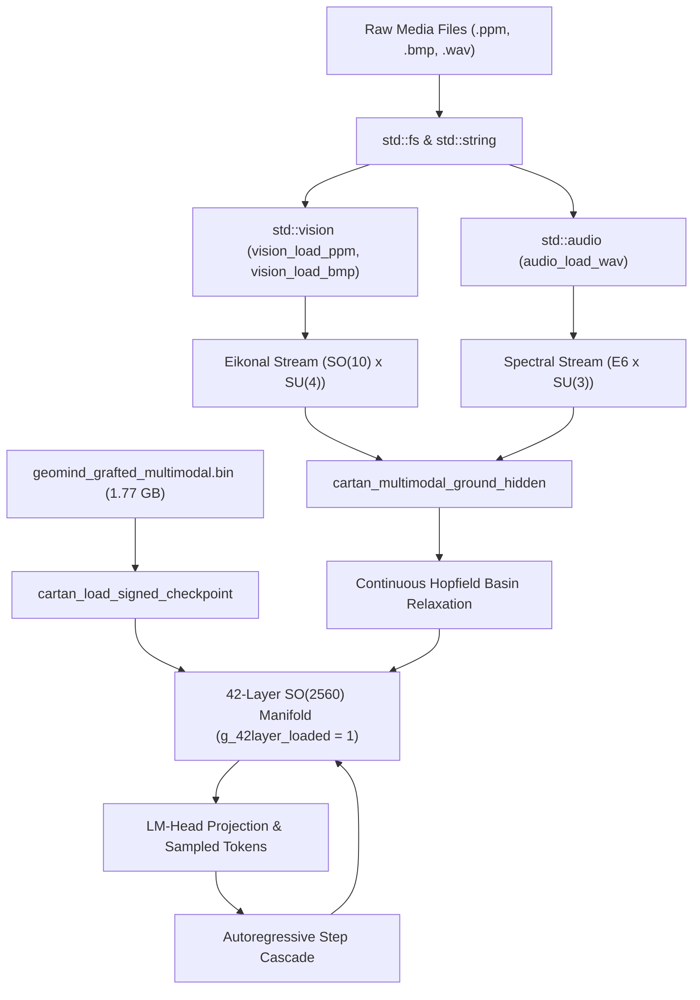

# Sprint 306: Native Multimodal I/O (BMP/PPM & WAV) & Grafted 42-Layer Conversational Inference

## Executive Summary
Following the successful completion of Sprint 305 (Multi-Tower Geodesic Grafting exporting `geomind_grafted_multimodal.bin`), GeoMind has full 42-layer manifold weights and vision/audio projection weights. However, conversational inference currently lacks native decoders for real visual media (PPM/BMP) and acoustic media (WAV), defaults to un-grafted layers when `--chat` is invoked, and lacks `--image` and `--audio` CLI parameter bindings. Sprint 306 eliminates all synthetic placeholders by implementing native binary decoders in `src/std/vision.cl` and `src/std/audio.cl`, binding them to CLI inputs, auto-loading the 1.77 GB grafted checkpoint, and advancing the 42-layer manifold during autoregressive token generation.

---

## Sprint Goals & Scope

### 1. Native Binary Image Decoders (`src/std/vision.cl`)
- **P6 PPM Decoder (`vision_load_ppm`)**:
  - Parse binary P6 header (magic `P6`, ASCII dimensions $W, H$, max value 255).
  - Extract contiguous binary RGB octets directly into `Image` struct (`Image { width, height, channels: 3.0, data }`).
- **24-bit Uncompressed BMP Decoder (`vision_load_bmp`)**:
  - Parse BMP 14-byte file header (magic `BM`, data offset) and 40-byte DIB header (`BITMAPINFOHEADER` width, height, 24 bpp).
  - Handle bottom-up scanlines with 4-byte padding alignment.
  - Reorder BGR to RGB channel tensors.

### 2. Native Binary Audio Decoder (`src/std/audio.cl`)
- **RIFF/WAVE PCM Decoder (`audio_load_wav`)**:
  - Parse RIFF header (`RIFF....WAVE`), `fmt ` subchunk (AudioFormat 1 = PCM, Channels 1 or 2, SampleRate, BitsPerSample 16), and `data` subchunk.
  - Stream 16-bit signed little-endian PCM samples into normalized `[-1.0, 1.0]` float values in `AudioBuffer`.

### 3. Checkpoint Auto-Discovery & Runtime Linkage (`src/cartanc/geomind_runtime.c`, `test/geomind/chat.cl`)
- Expose `cartan_load_signed_checkpoint(const char* filepath)` as an exported C function.
- Update checkpoint search list in `geomind_runtime.c` to prioritize `geomind_grafted_multimodal.bin`.
- Update `geomind_chat_start()` in `test/geomind/chat.cl` to detect and load `geomind_grafted_multimodal.bin`, activating `g_42layer_loaded = 1`.

### 4. CLI Multi-Modal Ingestion & Autoregressive Cascade (`test/geomind/main.car`, `test/geomind/chat.cl`)
- Support `--image <path>` and `--audio <path>` CLI options in `test/geomind/main.car`.
- Wire genuine decoded `Image` patches and `AudioBuffer` spectrograms into `cartan_multimodal_ground_hidden`.
- Update autoregressive token loop in `chat.cl` to run the updated hidden vector through `e8_attention_forward_step` with active 42-layer manifold and Sasaki MoE router gating.

### 5. Regression Test Target 58 (`test/compiler_suite/test_native_multimodal_io.car`)
- Generate authentic test PPM, BMP, and WAV sample files on disk.
- Verify `vision_load_ppm` and `vision_load_bmp` byte-exact pixel extraction.
- Verify `audio_load_wav` frequency and amplitude decoding against known signals.
- Verify end-to-end multimodal grounding into the 42-layer manifold.
- Register Target 58 in `test/compiler_suite/run_tests.car` and verify 58/58 test targets pass cleanly.

---

## Dependency Graph

