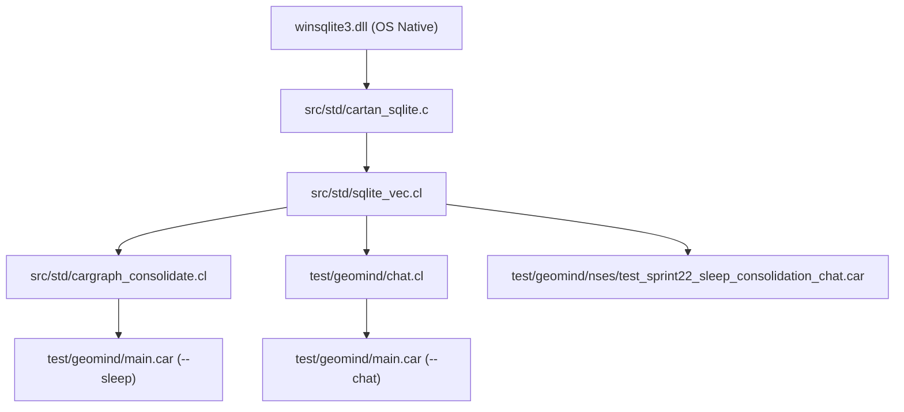

# Sprint 435 Implementation Plan: Phase B Metacognitive Sleep Consolidation & Interactive Cognitive Chat Integration

## 1. Executive Summary & Architectural Mission
Sprint 435 completes the Two-Tier Cognitive Memory Architecture ("The Full Enchilada") designed in Sprint 434 for GeoMind. Having established the Phase A substrate (embedded SQLite `winsqlite3.dll` C-FFI, 6-table schema, `.car_graph` v2 with strict 64-byte alignment, and world-state prompt scaffolding), Sprint 435 implements:
1. **Phase B Metacognitive Sleep Consolidation (`.car_graph` -> SQLite Sync)**:
   - SVO rule extraction from unconsolidated `episodes` recorded during chat turns.
   - Automated belief revision / contradiction resolution (superseding refuted facts, updating `status = 'superseded'` and `superseded_by_id`).
   - Ebbinghaus exponential synaptic decay & pruning (`access_count`, `decay_half_life_days`).
   - Dynamic CSR Hebbian weight flush from dynamic CSR graphs back to the `dependencies` table in Tier 2 DB.
   - Upgrading `cargraph_consolidate.cl` to `.car_graph` v2, preserving entity states and re-materializing clean binary buffers.
2. **Interactive Cognitive Chat Integration (`geomind.exe --chat`)**:
   - Connecting `sqlite_vec` and `.car_graph` v2 directly to the interactive chat loop in `test/geomind/chat.cl` and `test/geomind/main.car`.
   - Live world-state retrieval (`[WORLD-STATE: User.preferred_name='Rick']`) into prompt scaffolds.
   - Real-time conversational dialogue logging to the `episodes` table.
   - Dynamic entity state modifications (`/set entity.attr=val`, `/state`), fact storage (`/remember`), and on-demand sleep consolidation (`/sleep`).

---

## 2. Dependency Graph & Affected Modules

---

## 3. Detailed Component Architecture

### A. SQLite C-FFI Operations (`src/std/cartan_sqlite.c` & `src/std/sqlite_vec.cl`)
1. `cartan_sqlite_consolidate_unprocessed_episodes(void* db, double domain_id)`:
   - Scans `episodes` where `consolidated = 0`.
   - Parses dialogue statements matching fact patterns (e.g., user assertions) and creates corresponding `rule_elements` (status='active', confidence=0.9).
   - Marks processed episodes `consolidated = 1`.
2. `cartan_sqlite_supersede_rule(void* db, double old_elem_id, double new_elem_id)`:
   - Updates `rule_elements` set `status = 'superseded'` and marks dependency.
3. `cartan_sqlite_apply_ebbinghaus_decay(void* db, double domain_id, double min_confidence_thresh)`:
   - For non-strict rules (`is_strict = 0` and `status = 'active'`), applies Ebbinghaus retention decay factor $R = e^{-\Delta t / \text{half\_life}} \cdot (1 + 0.1 \cdot \log(1 + \text{access\_count}))$.
   - If confidence falls below threshold, marks `status = 'pruned'`.
4. `cartan_sqlite_flush_hebbian_weights(void* db, double src_id, double tgt_id, double weight)`:
   - Upserts updated CSR dynamic weight back into `dependencies` table.

### B. Consolidated `.car_graph` v2 Serialization (`src/std/cargraph_consolidate.cl`)
- Upgrade `cargraph_sleep_consolidate_file`:
  - Preserve `EntityStateEntry` records from existing `cg` into `b_new` during consolidation pass.
  - Upgrade `cargraph_serialize_to_file_with_csr` to v2 header layout (version = 2.0, 128-byte header, 64-byte aligned offsets, writing `off_entities` and entity records).

### C. Live Interactive Chat Integration (`test/geomind/chat.cl` & `test/geomind/main.car`)
- Maintain a persistent global or passed DB handle to `trainingdata/cognitive_memory.db`.
- Initialize default user entity state (`User.preferred_name = 'Rick'`).
- In `geomind_chat_start`: open DB, ensure schema, and mount `.car_graph` v2.
- In REPL loop:
  - Intercept `/set <entity>.<attr>=<val>` to update `entity_states` table.
  - Intercept `/state` to display all active entity states.
  - Intercept `/sleep` to trigger metacognitive sleep consolidation immediately.
  - Intercept `/remember <fact>` to log episode, insert into Hopfield, and add rule element.
  - On standard user turn: record user episode (`speaker='user'`), query active entity states, build prompt scaffold with `prompt_assemble_scaffold_v2()`, execute forward pass, record assistant response episode (`speaker='geomind'`).

---

## 4. Verification Gates (TS-22.1 through TS-22.4)
- **Gate TS-22.1: Metacognitive Episode Consolidation & Fact Extraction**:
  - Insert unconsolidated episodes into Tier 2 DB.
  - Execute consolidation pass; verify new active `rule_elements` extracted and episode `consolidated = 1`.
- **Gate TS-22.2: Belief Revision & Contradiction Supersession**:
  - Assert conflicting fact against existing rule element.
  - Verify older element is marked `status = 'superseded'` and newer fact is active.
- **Gate TS-22.3: Ebbinghaus Synaptic Decay & Hebbian Flush**:
  - Test decay formula on non-accessed rule elements; verify confidence decay and pruning.
  - Flush dynamic CSR weights to `dependencies` table; verify weight updates persist in SQLite.
- **Gate TS-22.4: End-to-End Chat Dialogue & Entity Memory Continuity**:
  - Simulate interactive chat turn: log episode, set entity state `User.preferred_name='Rick'`, materialize to `.car_graph` v2, and verify `prompt_assemble_scaffold_v2` injects `[WORLD-STATE: User.preferred_name='Rick']` into prompt text.
