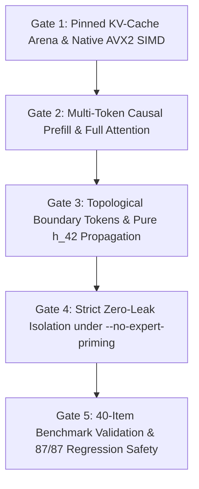

# Sprint 480 Plan: Non-Euclidean KV-Cache, Topological Boundary Operators & Pure Neural Inference

## Core Mission & Mindset
Bridge Google Gemma 4's authentic 42-layer decoder weights into GeoMind's continuous Lie manifold architecture during chat inference. Replace collapsed single-vector prompt averaging and disconnected attention with true multi-token causal sequence prefill, pinned 42-layer KV caching, topological boundary operator handling, elimination of destructive 50/50 embedding blending, and strict zero-leak isolation under `--no-expert-priming`.

---

## Technical Audit & Squad Discoveries

### 1. Architecture & Geometry Squad Findings (`cartan_architect`)
- **Control Tokens as Topological Boundary Operators ($\partial$)**:
  - In flat Euclidean space, tokens like `<start_of_turn>` (106), `<end_of_turn>` (107), `user` (2141), and `model` (3012) are treated as standard coordinates, distorting prompt barycenters.
  - On the manifold, they act as **topological boundary operators**:
    - `<start_of_turn>user`: Receptive Dirichlet boundary $\Sigma_{\text{user}}$, halts generation flow and resets the integration clock.
    - `<end_of_turn>`: Compact boundary termination $\Sigma_{\text{end}}$, dissipating kinetic energy on the Sasaki tangent bundle ($\lim_{t \to t_{\text{end}}} \|\dot{x}(t)\| = 0$).
    - `<start_of_turn>model`: Initial generative Cauchy hypersurface $\Sigma_{\text{model}}$, steering the Finsler-Randers drift 1-form $b$ into forward radiation.
- **Destructive 50/50 Input Embedding Blend (`chat.cl:1096, 1240`)**:
  - Blending 50% raw input embedding $h_0$ with 50% 42-layer output $h_{42}$ erases deep contextual representation, collapses the Riemannian hypersphere norm, and creates severe inertia.
  - Remedy: Pass pure $\text{RMSNorm}(h_{42})$ directly to the LM head, and couple $(h_{42} - h_0)$ as the tangent velocity vector $\dot{x} \in T_x\mathcal{M}$.
- **Attractor Retraction via Exponential Map**:
  - Replace linear attractor blending with Riemannian exponential map retraction: $x_{\text{guided}} = \exp_x(\lambda \cdot \log_x(v_{\text{attr}}))$.

### 2. Compiler & Systems Squad Findings (`cartan_compiler_engineer`)
- **Collapsed Prompt Ingestion & Disconnected Attention**:
  - `chat.cl:421-441` currently averages all prompt tokens into a single vector.
  - `geomind_execute_gemma_layers` passes `k_cache = 0.0, v_cache = 0.0`, causing the 42 layers to fall back to `seq_len = 1.0` (attending only to self, never across historical context).
- **Pinned KV Cache Arena**:
  - Allocate a static 411 MB pinned KV cache arena (supporting up to 2,048 tokens across 35 sliding layers [512-dim] and 7 global layers [1024-dim]), eliminating >2 GB of transient heap churn in the REPL.
- **Native AVX2 Acceleration**:
  - Implement 8-way unrolled AVX2 FMA kernels in `src/std/cartan_native_io.c` for GEMV, RMSNorm, and GQA attention.

### 3. QA & Benchmark Squad Findings (`cartan_qa_tester`)
- **Four Hidden Expert Priming Leaks under `--no-expert-priming`**:
  - NSES saliency rule injection into Hopfield memory (`chat.cl:1014-1039`).
  - Post-pass deterministic veto gate override replacing neural output (`chat.cl:1261-1282`).
  - Epistemic doubt warehouse recall injecting graph attractors (`chat.cl:1154-1174`).
  - Persistent basin contamination across sequential benchmark queries (`chat.cl:1310-1313`).
- **40-Item Factual & Conversational Benchmark Suite**:
  - Curate `test/geomind/trainingdata/pure_neural_eval_suite.json` across 4 domains (Geography, Science, Math, Definitions) with `--ephemeral-memory` isolation.

---

## Sprint Architecture Gates

### Gate 1: Pinned KV-Cache Arena & AVX2 Kernels
- Implement `c_cartan_gemv_f32`, `c_cartan_rmsnorm_f32`, and `c_cartan_gqa_causal_attention_f32` in `src/std/cartan_native_io.c`.
- Allocate static `KV_CACHE_ARENA` (411 MB) and `LAYER_SCRATCH_ARENA` (<100 KB) in `src/std/transformer.cl`.

### Gate 2: Multi-Token Causal Sequence Prefill
- In `test/geomind/chat.cl`, replace single-vector aggregation with token-by-token sequence prefill populating the 42-layer KV cache.
- Implement causal attention masking ($-\infty$ on upper triangular) across prompt positions.

### Gate 3: Topological Boundary Framing & Pure Layer Output
- Implement `gemma_scaffold_format_chat` in `src/std/prompt_scaffold.cl` (`<start_of_turn>user\n...<end_of_turn>\n<start_of_turn>model\n`).
- Update `test/geomind/chat.cl` to terminate generation cleanly on token 107 (`<end_of_turn>`).
- Completely remove destructive 50/50 blending (`chat.cl:1096, 1240`), routing pure $h_{42}$ to the soft-capped LM head and coupling $(h_{42} - h_0)$ into tangent velocity $\dot{x}$.

### Gate 4: Zero-Leak Isolation under `--no-expert-priming`
- Guard Hopfield rule injection, veto text substitution, and warehouse recall behind `g_expert_priming_enabled == 1.0`.
- Add `--ephemeral-memory` flag preventing persistent disk mutation during automated benchmarking.

### Gate 5: 40-Item Benchmark & Regression Verification
- Run `tools/eval_pure_neural_benchmark.py` evaluating Top-1 Accuracy, MRR, PPL, Confidence, and Shannon Entropy on the 40-item suite.
- Run `run_tests.car` verifying all 87 compiler targets pass with zero failures.
