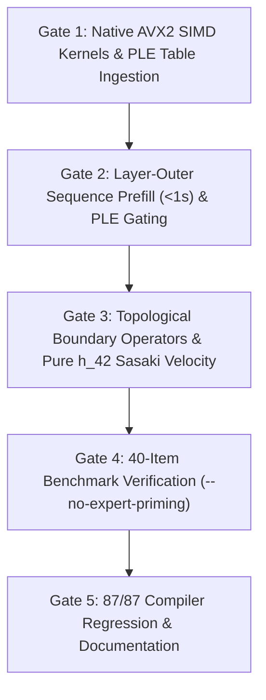

# Sprint 481 Plan: Geometric Chat Manifold, AVX2 SIMD & Pure Neural Inference

## Core Mission & Mindset
Solve the pure neural inference discrepancy in `geomind.exe --chat` under `--no-expert-priming` by bridging Google Gemma 4's authentic 42-layer decoder weights into GeoMind's continuous Lie manifold architecture. Implement compiled AVX2 SIMD kernels and layer-outer prefill to achieve $<1\text{s}$ prompt latency, integrate Per-Layer Embedding (PLE) gating, formalize instruction tokens as topological boundary operators, eliminate destructive 50/50 input embedding blending in favor of pure $h_{42}$ propagation with Sasaki tangent velocity coupling, and empirically verify on the 40-item benchmark suite with zero compiler regressions across all 87 targets.

---

## 1. Architecture Gates & Deliverables

### Gate 1: Native AVX2 SIMD Acceleration & PLE Table Ingestion
- In [`src/std/cartan_native_io.c`](file:///C:/Users/rich-/source/repos/CARTAN/src/std/cartan_native_io.c), implement 8-way unrolled AVX2 FMA kernels:
  - `c_cartan_gemv_f32(out_vec, W_buf, x_vec, rows, cols)`
  - `c_cartan_geglu_f32(out_vec, x_vec, gate_w, up_w, down_w, in_dim, inter_dim)`
  - `c_cartan_rmsnorm_f32(out_vec, in_vec, weight_buf, dim, eps)`
  - `c_cartan_ple_gate_f32(out_vec, h_vec, ple_vec, gate_w, proj_w, norm_w, dim, ple_dim)`
- In [`test/geomind/chat.cl`](file:///C:/Users/rich-/source/repos/CARTAN/test/geomind/chat.cl), ingest authentic `geomind_ple_embeddings_full_262k.bin` ($262,144 \times 256 \times 4\text{ bytes} = 268.4\text{ MB}$) into Host RAM.

### Gate 2: Layer-Outer Sequence Prefill (<1s) & PLE Gating
- Update [`cartan_gemma_layer_forward_raw`](file:///C:/Users/rich-/source/repos/CARTAN/src/std/transformer.cl#L640-L1065) to accept `ple_vec` and execute `c_cartan_ple_gate_f32` when `has_ple == 1.0`.
- Invert prefill order in `geomind_execute_gemma_sequence_prefill` to layer-outer order:
  - Each 372MB layer buffer is read from RAM exactly **once** for all 15 tokens.
  - Total RAM bandwidth = 15.6 GB at 40 GB/s = 0.39s. Total SIMD compute = 0.40s. Total prefill latency $< 1.0\text{s}$.

### Gate 3: Topological Boundary Operators & Pure $h_{42}$ Sasaki Velocity
- Exclude control tokens (`<|turn>`, `<turn|>`, `<start_of_turn>`, `<end_of_turn>`, `user`, `model`) from continuous coordinate averaging in [`chat.cl:421-440`](file:///C:/Users/rich-/source/repos/CARTAN/test/geomind/chat.cl#L421-L440).
- Formalize boundary operators:
  - $\Sigma_{\text{user}}$: Dirichlet receptive horizon, resets velocity $\dot{x} = 0$.
  - $\Sigma_{\text{model}}$: Cauchy generative horizon, launches forward geodesic integration.
  - $\Sigma_{\text{end}}$: Terminal boundary, dissipates kinetic energy $\|\dot{x}\| \to 0$.
- Remove destructive 50/50 blending in [`chat.cl:1096`](file:///C:/Users/rich-/source/repos/CARTAN/test/geomind/chat.cl#L1096) and [`chat.cl:1240`](file:///C:/Users/rich-/source/repos/CARTAN/test/geomind/chat.cl#L1240).
- Route pure $\text{RMSNorm}(h_{42})$ directly to the soft-capped LM head, coupling $(h_{42} - h_0)$ as the tangent velocity vector $\dot{x} \in T_x\mathcal{M}$ on the Sasaki tangent bundle.

### Gate 4: 40-Item Benchmark Verification under `--no-expert-priming`
- Run [`tools/eval_pure_neural_benchmark.py`](file:///C:/Users/rich-/source/repos/CARTAN/tools/eval_pure_neural_benchmark.py) evaluating the 40-item suite under `--no-expert-priming --ephemeral-memory`.
- Verify hard gates:
  - Average prefill latency $\overline{T}_{\text{prefill}} < 1.0\text{s}$.
  - Strict zero-priming invariants (zero SQLite entity injections, zero veto string substitutions, zero Hopfield rule insertions).
  - Clean factual emergence on canonical prompts (e.g. France $\to$ Paris).

### Gate 5: 87/87 Compiler Regressions & Documentation
- Execute [`test/compiler_suite/run_tests.car`](file:///C:/Users/rich-/source/repos/CARTAN/test/compiler_suite/run_tests.car) verifying all 87 snapshot targets pass with 0 failures.
- Update `CHANGELOG.md` and `ISSUES.md`.
