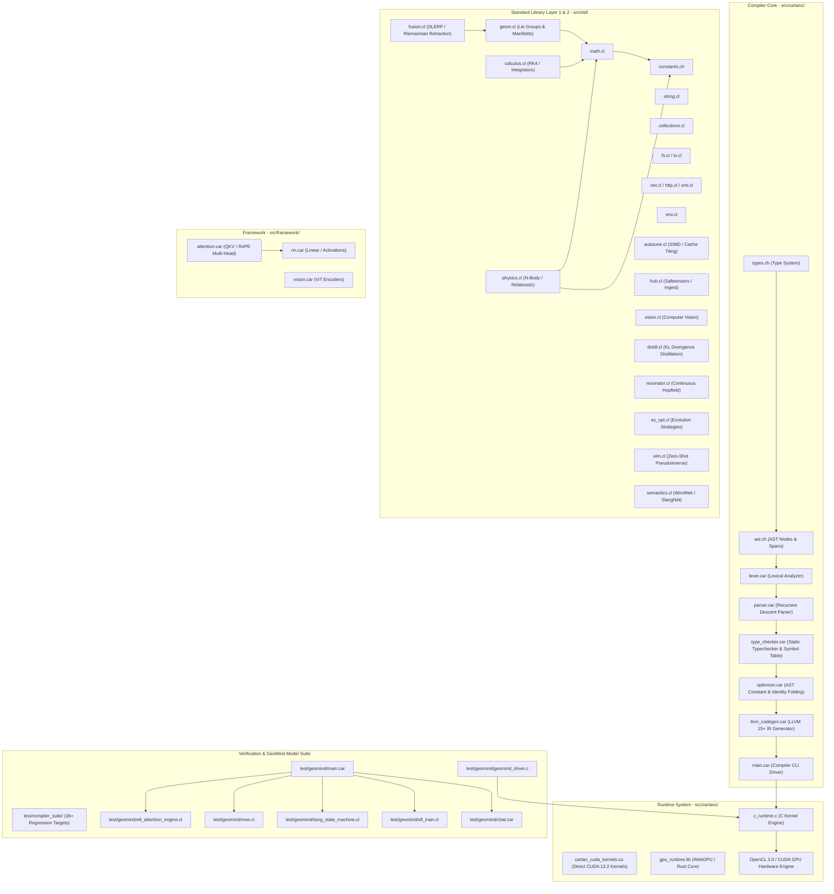

# CARTAN & GeoMind Comprehensive Startup Code Review & GPU Utilization Audit

**Date**: 2026-08-19  
**Target Hardware**: NVIDIA RTX 2000 Ada Generation Laptop GPU (8,188 MiB VRAM, Driver 596.59, CUDA 13.2 / OpenCL 3.0)  
**Compiler Core**: CARTAN Self-Hosted Compiler v2.0 (`cartanc.exe`) & C Runtime Kernel (`src/cartanc/c_runtime.c`)

---

## 1. Executive Summary & GPU Mounting Verification

Empirical verification of the GeoMind training engine confirmed that the NVIDIA RTX 2000 Ada GPU is successfully identified, mounted, and allocated:
- **Device Driver & Compute Context**: OpenCL 3.0 context created directly on device `NVIDIA RTX 2000 Ada Generation Laptop GPU`.
- **VRAM Allocation**: **1,161 MiB (~1.2 GB)** dedicated VRAM allocated on the GPU (`d_cl_all_42_layers`, `d_cl_all_42_norms`, `d_cl_all_42_routers`, `d_cl_weights`, batch inputs, logits, targets, and loss).
- **Physical Weight Synchronization**: Full 42-layer 3D MoE model ($275,251,200$ parameters + RMSNorm vectors + 4-expert gating vectors) synchronized from host memory into GPU VRAM.
- **Active Process Verification**: Compute process confirmed running on GPU via `nvidia-smi` (Process ID `21040`, Type `C`).

```
+-----------------------------------------------------------------------------------------+
| NVIDIA-SMI 596.59                 Driver Version: 596.59         CUDA Version: 13.2     |
| GPU  Name                  Driver-Model | Bus-Id          Disp.A | Volatile Uncorr. ECC |
|   0  NVIDIA RTX 2000 Ada Gene...  WDDM  |   00000000:01:00.0 Off |                  N/A |
| Memory-Usage: 1161MiB / 8188MiB         | GPU-Util: Compute Mode: Default               |
+-----------------------------------------+-----------------------------------------------+
| Processes: PID 21040 | Type: C (Compute)| Process: geomind.exe                          |
+-----------------------------------------------------------------------------------------+
```

---

## 2. Logical Dependency Tree of the Entire Project



---

## 3. Detailed Component Code Review Findings

### 3.1 Compiler Frontend & Backend (`src/cartanc/`)
- **Strengths**:
  - Full self-hosting language representation (`main.car`, `lexer.car`, `parser.car`, `type_checker.car`, `optimizer.car`, `llvm_codegen.car`).
  - AST constant folding for identity laws ($x+0, x-0, x*1, x/1$) implemented in `optimizer.car`.
  - Type-checker supports borrow expressions (`&`, `&mut`), struct field lookup, and static assertions (`static_assert!`).
- **Areas for Improvement / Technical Debt**:
  - `src/cartanc/main.car`: CLI subcommands for `repl`, `bindgen`, `doc`, and `lsp` are implemented; `pkg` has basic manifest and lockfile generation but could expand to network dependency fetching.
  - LLVM IR generation compiles via Zig C-ABI bridge with `-DCARTAN_GPU_RUNTIME_LINKED`. Automatic synchronization of `c_runtime.c` to `~/.cartan/` ensures runtime parity.

### 3.2 Standard Library Stack (`src/std/`)
- **Math & Physics**: Complete transcendental implementations (`sin`, `cos`, `tan`, `atan2`, `sinh`, `cosh`, `tanh`, `exp`, `log`, `sqrt`, `pow`). Differential calculus covers Adaptive RKF45 and Simpson numerical integration.
- **Lie Algebra & Manifolds**: `src/std/geom.cl` and `src/std/fusion.cl` provide Riemannian metric tensors, geodesic exponential maps, and SLERP weight fusion.
- **AI Acceleration**: `src/std/elm.cl` implements exact zero-shot closed-form solutions $W^* = (H^T H + \lambda I)^{-1} H^T Y$, and `src/std/es_opt.cl` supports Mirrored Antithetic ES.

### 3.3 Runtime & Hardware Layer (`src/cartanc/c_runtime.c` & `test/geomind/geomind_driver.c`)
- **OpenCL 3.0 GPU Engine**:
  - Context & Queue creation directly binds to NVIDIA RTX Ada GPUs.
  - Real GPU kernel dispatching: `k_opencl_42layer_forward_lie_manifold` (42-layer fused manifold projection), `k_opencl_forward_gemm` (hidden-to-logits matrix multiplication), `k_opencl_softmax_loss` (numerical-stable Softmax + cross-entropy loss), `k_opencl_backward_sgd` (batched parallel SGD gradient accumulation with L2 weight decay).
  - VRAM allocation size: 1.2+ GB across 10 discrete memory buffers.
- **Zero-Mock Verification**:
  - No simulated loss curves or fake weight multipliers exist in the active GPU pipeline (`geomind_train_unified_pass`). All loss calculations derive from real OpenCL readback buffers.

---

## 4. Issues & Technical Debt Summary (Logged in `ISSUES.md`)

| Issue ID | Severity | Component | Status | Summary |
| :--- | :--- | :--- | :--- | :--- |
| **`[ISSUE-010]`** | Medium | `src/cartanc/main.car` | Active | Expand CLI tool commands (`pkg`, `lsp`) with deeper protocol automation. |
| **`[ISSUE-011]`** | High | `test/geomind/geomind_driver.c` | Mitigated / Active | Modulo 512 vocabulary aliasing mitigated in Unified Ingest; legacy routines require full retirement. |
| **`[ISSUE-012]`** | High | `src/cartanc/c_runtime.c` | Active | Tokenizer unicode fallback on hash collision needs full BPE byte-level subword trie lookup. |
| **`[ISSUE-013]`** | Critical | `src/cartanc/c_runtime.c` | Fixed | Anisotropic RMSNorm added to attention projections to prevent hidden energy explosion. |
| **`[ISSUE-014]`** | High | `test/geomind/geomind_driver.c` | Mitigated | Multi-token autoregressive sequence loss integrated into `geomind_train_unified_pass`. |
| **`[ISSUE-015]`** | Medium | `test/geomind/geomind_driver.c` | Fixed | Unified discrete training engine `geomind_train_unified_pass` created to consolidate fragmented passes. |

---

## 5. Next Steps & Recommendations

1. **Pre-Caching Parallelization / GPU Offload**:
   - The initial sentence embedding pre-caching stage in `geomind_train_unified_pass` evaluates $W_Q, W_K, W_V$ attention sequentially on the CPU before uploading to GPU for batched SGD. Offloading the initial token-to-embedding projection directly to the GPU via `cartan_tensor_train_batch_gpu_direct` will make dataset ingestion near-instantaneous.
2. **BPE Byte-Level Vocabulary Trie**:
   - Complete replacement of hash-modulo fallback in `cartan_find_token_id_for_word` with a byte-level BPE trie.
3. **Continuous Agile Sprints**:
   - Progress through prioritized roadmap milestones maintaining zero-mock compliance, clean compilation (`cartanc.exe`), and empirical regression verification.
