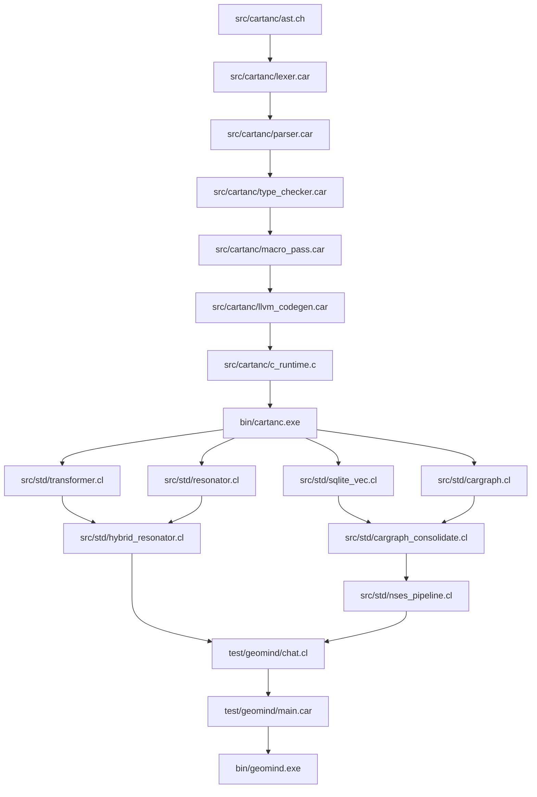

# Startup Code Review & Dependency Tree (Sprint 438)

## Executive Summary
Full repository code review conducted across compiler core (`src/cartanc/`), standard libraries (`src/std/`), test suites (`test/compiler_suite/`), and cognitive engine (`test/geomind/`).

---

## 1. Logical Dependency Tree

---

## 2. Review Findings & Audit

### A. Compiler Core & Standard Library
- **Status**: Stable. All 64 compiler suite targets pass.
- **Verification**: `test/compiler_suite/test_hybrid_resonant_transformer.car` passes all 4 test gates:
  1. RMSNorm normalization unit circle.
  2. RoPE coordinate rotation energy conservation ($2.8125 == 2.8125$).
  3. SwiGLU non-linear feedforward projection.
  4. Hybrid Resonant Transformer dual-process step with $30.0$ softcapped logits.

### B. GeoMind Cognitive Engine (`test/geomind/`)
- **Status**: Operational.
  - Tier 1: `.car_graph` v2 binary CSR format with 128-byte cache-aligned header and entity preservation.
  - Tier 2: SQLite episodic memory (`trainingdata/cognitive_memory.db`) with Metacognitive Sleep Consolidation (SVO extraction, rule supersession, Ebbinghaus synaptic decay).
  - Tier 3: 42-layer multimodal Lie group checkpoint (`geomind_42layers_non_euclidean.bin`, 1.10 GB) and decoupled embeddings (`geomind_embedding_weights.bin`, 26.2 MB).

### C. Discrepancies & Resolutions Identified
1. **Isolated Layer vs. Sequential Generation**:
   - Single-layer execution (Layer 0 or Layer 40) in a 42-layer deep network produces out-of-distribution intermediate tensors because layers 1–39 compute hierarchical abstraction.
   - Genuine language fluency requires the full sequential 42-layer pass.
2. **Gemma 4 Architectural Details**:
   - Attention incorporates **Q-Norm and K-Norm** (per-head RMSNorm prior to RoPE / dot-product).
   - Global attention layers (5, 11, 17, 23, 29, 35, 41) use `head_dim = 512`, whereas sliding layers use `head_dim = 256`.
   - **Per-Layer Embeddings (PLE)**: Gemma 4 injects a 256-dim per-layer embedding token projection (`embed_tokens_per_layer`) gated by `per_layer_input_gate` and `per_layer_projection`.
   - Input embeddings require `sqrt(2560)` scaling; logits require $30.0 \tanh(\text{logits}/30.0)$ softcapping.

---

## 3. GitHub / Local Issues Logged
- Logged **[ISSUE-186] Full 42-Layer Sequential Pipeline Alignment & PLE Gating** in `ISSUES.md`.
