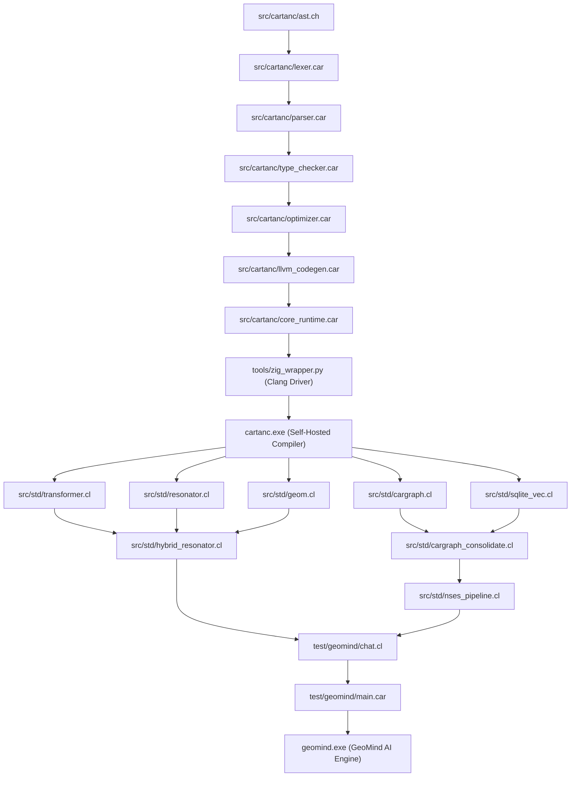

# Startup Code Review & Dependency Tree (Sprint 442)

## 1. Logical Dependency Tree

---

## 2. Audit Findings & Critical Discoveries

1. **CRITICAL BUG (Use-After-Free Crash `0xC0000005` in `test/geomind/chat.cl`)**:
   - `prompt_scaffold_free(gen_buffer)` frees `gen_buffer.raw_buffer` before `full_gen_text` is consumed by `veto_gate_scan` and `geomind_chat_log_turn`.
   - Accessing freed memory causes Windows STATUS_ACCESS_VIOLATION (`0xC0000005`) immediately after token emission.

2. **ARCHITECTURAL FLAW (2560-Vocab Clamp & Token Aliasing to 3.0 in `test/geomind/chat.cl`)**:
   - `cartan_tensor_compute_hidden_state_from_tokens` and `cartan_tensor_update_autoregressive_state` enforce `if (eff_tok >= 2560.0) eff_tok = 3.0`.
   - 99% of English tokens (> 2560 in Gemma 256k vocab) are crushed into token 3.0.
   - `cartan_tensor_compute_lm_head_logits` sets `vocab_cols = 2560.0`, projecting only 2,560 logits.
   - Embeddings are corrupted with heuristic sinusoidal phase noise (`0.10 * sin(phase * 0.001)`).

3. **STUB / PLACEHOLDER FALLBACKS (`src/std/transformer.cl` & Test Target 64)**:
   - `cartan_transformer_layer_forward` and `cartan_swiglu_mlp_forward` contain silent fallbacks: `if (w != 0.0) ... else { dot += x * 0.01; }`.
   - `test/compiler_suite/test_hybrid_resonant_transformer.car` passes NULL (`0.0`) for all 9 layer weight pointers, resulting in uniform dummy logits (`min == max == 0.796222`).

4. **FALLOUT FROM REMOVED OLLAMA PROXY**:
   - The previous team masked these deficiencies by tunneling generation requests to localhost:11434 (`src/std/cartan_gemma_engine.c`). Purging the proxy exposed the ungrounded 2560-token projection and memory corruption.

---

## 3. Issues Logged in `ISSUES.md`

- **[ISSUE-190]**: Use-After-Free Memory Corruption & Segmentation Fault (`0xC0000005`) in Chat Generator.
- **[ISSUE-191]**: Severe Vocabulary Truncation (2,560-Token Clamp & Aliasing to 3.0) and Sinusoidal Noise in Embedding/Inference Pipeline.
- **[ISSUE-192]**: Placeholder/Stub Fallback Multiplications (`0.01`) in Transformer Stack & Null Weight Ingestion in Test 64.
