# Startup Code Review: Sprint 450

**Date**: 2026-09-27  
**Author**: Antigravity Pair Programmer (Daddy Rick / Rick & Antigravity)  
**Sprint**: 450  
**Scope**: Master Codebase Audit, Logical Dependency Graph, Technical Debt Discovery, & Roadmap Alignment

---

## 1. Executive Summary

Sprint 449 achieved 100% test pass parity across all 59 targets in the hardened compiler regression harness (`build/run_tests.exe`), fully eliminating compiler diagnostic masking and resolving parser namespace token collisions.

For Sprint 450, we conducted a comprehensive review of the entire codebase (`src/cartanc/`, `src/std/`, `src/framework/`, and `test/`) with a focus on:
1. Identifying unlinked built-in language externs and cognitive control block lifecycle hooks.
2. Eliminating compiler and linker warnings across the toolchain.
3. Establishing the complete logical dependency graph across all compiler, standard library, and model subsystems.

---

## 2. Full Logical Dependency Tree

```mermaid
graph TD
    subgraph Compiler Frontend
        Lexer["src/cartanc/lexer.car"] --> Parser["src/cartanc/parser.car"]
        Parser --> AST["src/cartanc/ast.ch"]
    end

    subgraph Compiler Backend
        AST --> Codegen["src/cartanc/llvm_codegen.car"]
        Codegen --> NativeExe["Zig / Clang Toolchain (-O3 LTO)"]
    end

    subgraph Freestanding Runtime
        CoreRT["src/cartanc/core_runtime.car"] --> NativeExe
        IO_C["src/std/cartan_native_io.c"] --> NativeExe
    end

    subgraph Standard Library Layer 1
        Math["src/std/math.cl"]
        Collections["src/std/collections.cl"]
        FS["src/std/fs.cl"]
        StringMod["src/std/string.cl"]
        Constants["src/std/constants.ch"]
    end

    subgraph Standard Library Layer 2
        Tensor["src/std/tensor.cl"]
        Geom["src/std/geom.cl"]
        Resonator["src/std/resonator.cl"]
        Hebbian["src/std/hebbian.cl"]
        Semantics["src/std/semantics.cl"]
        Hub["src/std/hub.cl"]
        Vision["src/std/vision.cl"]
        Audio["src/std/audio.cl"]
        Sleep["src/std/sleep.cl"]
        Reasoning["src/std/reasoning.cl"]
        ESOpt["src/std/es_opt.cl"]
        CarGraph["src/std/cargraph.cl"]
        SQLiteVec["src/std/sqlite_vec.cl"]
        Transformer["src/std/transformer.cl"]
    end

    subgraph Framework Layer
        NN["src/framework/nn.car"]
        Attention["src/framework/attention.car"]
        VisionFW["src/framework/vision.car"]
    end

    subgraph Model & Verification Suites
        GeomindChat["test/geomind/chat.cl"]
        GeomindMain["test/geomind/main.car"]
        CompilerSuite["test/compiler_suite/run_tests.car (59 Targets)"]
    end

    Tensor --> Math
    Tensor --> Collections
    Geom --> Math
    Resonator --> Collections
    Resonator --> Math
    Semantics --> StringMod
    Semantics --> Collections
    Vision --> FS
    Audio --> FS
    Sleep --> Resonator
    Sleep --> CarGraph
    NN --> Tensor
    Attention --> Tensor
    VisionFW --> NN
    GeomindChat --> Resonator
    GeomindChat --> Geom
    GeomindChat --> Transformer
    CompilerSuite --> CoreRT
    CompilerSuite --> Tensor
    CompilerSuite --> Resonator
```



### Dependency Hierarchy Summary:
- **Level 0 (Compiler Core)**: `lexer.car` -> `parser.car` -> `ast.ch` -> `llvm_codegen.car` -> `main.car`.
- **Level 1 (Freestanding Runtime)**: `core_runtime.car` is automatically injected into every compiled translation unit. Provides trees, vectors, strings, tensors, memory arenas, and OS primitives.
- **Level 2 (Standard Library Foundations)**: `math.cl`, `constants.ch`, `collections.cl`, `fs.cl`, `string.cl`.
- **Level 3 (Mathematics & Cognitive Subsystems)**: `tensor.cl`, `geom.cl`, `resonator.cl`, `hebbian.cl`, `fusion.cl`, `semantics.cl`, `sleep.cl`, `reasoning.cl`, `es_opt.cl`.
- **Level 4 (Data & Multimodal I/O)**: `hub.cl`, `vision.cl`, `audio.cl`, `cargraph.cl`, `sqlite_vec.cl`.
- **Level 5 (Framework & Model Topologies)**: `src/framework/` (`nn.car`, `attention.car`, `vision.car`) and `test/geomind/` (`chat.cl`, `train.cl`, `streams.cl`, `main.car`).
- **Level 6 (Test & Regression Validation)**: 59 compiler test targets in `test/compiler_suite/run_tests.car`.

---

## 3. Findings & Technical Debt Discovery

### Discovery 1: Unimplemented Built-In Externs Declared in `llvm_codegen.car` (`[ISSUE-211]`)
- **Location**: `src/cartanc/llvm_codegen.car:500-520`
- **Details**:
  During the Sprint 287 migration to freestanding self-hosting, built-in language extern declarations were added to `llvm_codegen.car` without native implementations in `src/cartanc/core_runtime.car`:
  1. Cognitive block lifecycle hooks:
     - `cartan_rt_override_begin` / `cartan_rt_override_end` (for `override { ... }` scopes)
     - `cartan_rt_chain_begin` / `cartan_rt_chain_end` (for `chain { ... }` blocks)
     - `cartan_rt_route_begin` / `cartan_rt_route_end` (for `route { ... }` blocks)
     - `cartan_rt_grok_begin` / `cartan_rt_grok_end` (for `grok { ... }` blocks)
     - `cartan_rt_doubt_begin` / `cartan_rt_doubt_end` (for `doubt { ... }` blocks)
     - `cartan_rt_multimodal_sync_start` (for `multimodal { ... }` blocks)
  2. Tensor and string built-in helpers:
     - `cartan_tensor_ones_like(A)` / `cartan_tensor_zeros_like(A)`
     - `cartan_tensor_transpose(A)`
     - `cartan_pattern_match(cond, pattern)` (for prompt pattern matching `match text { p"..." => ... }`)
- **Impact**: Any user code utilizing native language control blocks (`doubt`, `chain`, `route`, `grok`, `override`, `match p"..."`) fails at link time unless it manually imports standard library files.
- **Remediation**: Implement all missing lifecycle hooks and tensor built-ins directly in `src/cartanc/core_runtime.car`.

### Discovery 2: Compiler Warning on `_CRT_SECURE_NO_WARNINGS` Redefinition (`[ISSUE-212]`)
- **Location**: `src/std/cartan_native_io.c:1`
- **Details**:
  `cartan_native_io.c` defines `#define _CRT_SECURE_NO_WARNINGS` unconditionally on line 1, while Zig/Clang compilation command lines pass `-D_CRT_SECURE_NO_WARNINGS 1`, emitting a compiler diagnostic warning on every build:
  ```
  src/std/cartan_native_io.c:1:9: warning: '_CRT_SECURE_NO_WARNINGS' macro redefined [-Wmacro-redefined]
  ```
- **Remediation**: Wrap line 1 with `#ifndef _CRT_SECURE_NO_WARNINGS` ... `#endif`.

---

## 4. Sprint 450 Scope & Recommendations

1. **Resolve `[ISSUE-211]`**: Implement complete native freestanding support for all cognitive control blocks (`override`, `chain`, `route`, `grok`, `doubt`, `multimodal`), tensor helpers (`ones_like`, `zeros_like`, `transpose`), and pattern matching in `src/cartanc/core_runtime.car`.
2. **Resolve `[ISSUE-212]`**: Clean up `_CRT_SECURE_NO_WARNINGS` macro definition in `src/std/cartan_native_io.c` to achieve 100% warning-free compilation.
3. **Rebuild Self-Hosted Compiler**: Recompile `cartanc.exe` with updated `core_runtime.car`.
4. **Empirical Regression Verification**: Re-run the full 59-target test suite (`build/run_tests.exe`) to confirm zero regressions and clean exit code 0.
