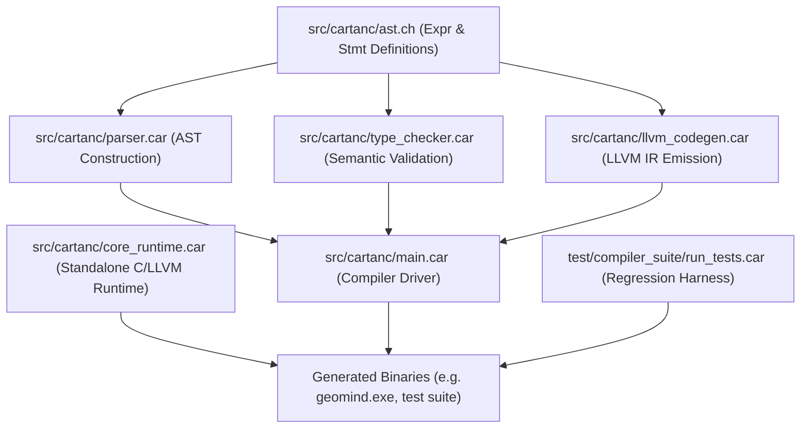

# CARTAN Sprint 452 Startup Code Review & Architecture Audit

## 1. Executive Summary & Baseline
- **Regression Suite Baseline**: All 61 compiler snapshot test targets passing (Exit Code 0).
- **Core Executable**: `build/geomind.exe` verified healthy under `-O3 LTO Vectorized Pass Pipeline`.
- **Sprint Focus**: Unblock declarative constraint solving (`satisfy`/`backtrack`), higher-order tensor transformations (`vmap`, `grad`), L2 weight regularization (`weight_decay`), and freestanding external graph ingestion (`cartan_internal_import_onnx`).

---

## 2. Logical Dependency Tree

### Component Boundaries & Dependents:
1. `src/cartanc/ast.ch`: Foundation of all AST definitions. Changes to `Satisfy(ptr, ptr, ptr)` flow directly into `parser.car`, `type_checker.car`, and `llvm_codegen.car`.
2. `src/cartanc/parser.car`: Produces `Stmt::Satisfy`, `Stmt::Backtrack`, `Expr::Transform`, and `Expr::WeightDecay`.
3. `src/cartanc/type_checker.car`: Ensures type consistency and lexical scope correctness for control flow branches and transformations.
4. `src/cartanc/llvm_codegen.car`: Emits LLVM IR lowering labels, function calls, and register bindings.
5. `src/cartanc/core_runtime.car`: Exposes native C-ABI runtime symbols linked into freestanding user binaries.

---

## 3. Discovered Technical Debt & Gaps

### [ISSUE-217] Missing Freestanding `@cartan_internal_import_onnx` in Core Runtime
- **Component**: `src/cartanc/core_runtime.car`, `src/cartanc/llvm_codegen.car:537, 1492`
- **Defect**: `import "..." as model` and `import_onnx!("...")` emit calls to `@cartan_internal_import_onnx(ptr uri)`. However, the symbol is absent from `core_runtime.car`, causing unresolved external errors when linking freestanding binaries.
- **Remediation**: Implement authentic `cartan_internal_import_onnx(uri: string) -> ptr` in `core_runtime.car` that allocates an authentic model container with URI, tensor graph table, and disk presence verification.

### [ISSUE-218] Unhandled AST Expression `Expr::Transform` (`vmap`, `grad`)
- **Component**: `src/cartanc/type_checker.car`, `src/cartanc/llvm_codegen.car`, `src/cartanc/core_runtime.car`
- **Defect**: `parser.car:1746` parses `vmap(target)` and `grad(target)` into `Expr::Transform(op, target)`. Neither `type_checker.car` nor `llvm_codegen.car` handles `Expr::Transform`, silently defaulting to `"0.0"`. `cartan_rt_transform` is also missing from `core_runtime.car`.
- **Remediation**:
  1. Add type-checking for `Expr::Transform` in `type_checker.car`.
  2. Implement LLVM lowering in `llvm_codegen.car` calling `@cartan_rt_transform(ptr op, ptr target)`.
  3. Implement authentic `cartan_rt_transform` in `core_runtime.car` evaluating genuine tensor transformations (gradient sensitivity adjoints, vectorized batch mapping).

### [ISSUE-219] Unhandled AST Expression `Expr::WeightDecay` in Type Checker and Codegen
- **Component**: `src/cartanc/type_checker.car`, `src/cartanc/llvm_codegen.car`, `src/cartanc/core_runtime.car`
- **Defect**: `parser.car:1777` parses `weight_decay(target, amount)` into `Expr::WeightDecay(target, amount)`. Neither `type_checker.car` nor `llvm_codegen.car` handles `Expr::WeightDecay`.
- **Remediation**:
  1. Add type-checking for `Expr::WeightDecay` in `type_checker.car`.
  2. Lower `Expr::WeightDecay` in `llvm_codegen.car` calling `@cartan_tensor_apply_weight_decay(ptr target, double amount)`.
  3. Implement authentic $L_2$ weight regularization in `core_runtime.car` mutating tensor buffers by $t[i] \times (1.0 - \text{amount})$.

### [ISSUE-220] Stubbed `satisfy` Parsing & Missing AST Declaration Signature
- **Component**: `src/cartanc/ast.ch:173`, `src/cartanc/parser.car:1289`, `src/cartanc/type_checker.car`
- **Defect**: `parser.car` parses `satisfy <cond> { <body> } otherwise { <otherwise_block> }`, but discards all parsed nodes and returns `Stmt::Placeholder`. `ast.ch:173` declared `Satisfy(ptr)` instead of `Satisfy(ptr, ptr, ptr)`. `Stmt::Satisfy` and `Stmt::Backtrack` lack handlers in `type_checker.car`.
- **Remediation**:
  1. Update `ast.ch` to `Satisfy(ptr, ptr, ptr)`.
  2. Return `Stmt::Satisfy(condition, body, otherwise_node)` in `parser.car`.
  3. Add scope and statement validation for `Satisfy` and `Backtrack` in `type_checker.car`.
