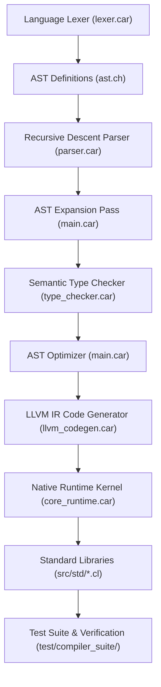

# Startup Code Review & Technical Debt Audit - Sprint 453

## 1. Project Architecture & Logical Dependency Tree

### Module Linkage & Dependencies
- **Frontend Core**: [`src/cartanc/lexer.car`](file:///C:/Users/rich-/source/repos/CARTAN/src/cartanc/lexer.car) $\to$ [`src/cartanc/ast.ch`](file:///C:/Users/rich-/source/repos/CARTAN/src/cartanc/ast.ch) $\to$ [`src/cartanc/parser.car`](file:///C:/Users/rich-/source/repos/CARTAN/src/cartanc/parser.car).
- **Transformation Pipeline**: [`src/cartanc/main.car`](file:///C:/Users/rich-/source/repos/CARTAN/src/cartanc/main.car) orchestrates AST expansion and constant folding.
- **Semantic Validation**: [`src/cartanc/type_checker.car`](file:///C:/Users/rich-/source/repos/CARTAN/src/cartanc/type_checker.car) verifies types, scopes, and variable bindings.
- **Backend Codegen**: [`src/cartanc/llvm_codegen.car`](file:///C:/Users/rich-/source/repos/CARTAN/src/cartanc/llvm_codegen.car) lowers AST constructs directly to LLVM IR.
- **Runtime Kernel**: [`src/cartanc/core_runtime.car`](file:///C:/Users/rich-/source/repos/CARTAN/src/cartanc/core_runtime.car) provides bare-metal tensors, vectors, strings, and built-ins.
- **Test Harness**: [`test/compiler_suite/run_tests.car`](file:///C:/Users/rich-/source/repos/CARTAN/test/compiler_suite/run_tests.car) drives regression suite (62 active targets).

---

## 2. Discovered Issues & Technical Debt

### [ISSUE-221] Unimplemented Native `for` Loop (`ForStmt`) across Compiler Pipeline
- **Severity**: High (Language Feature Completeness)
- **Component**: [`src/cartanc/parser.car`](file:///C:/Users/rich-/source/repos/CARTAN/src/cartanc/parser.car), [`src/cartanc/type_checker.car`](file:///C:/Users/rich-/source/repos/CARTAN/src/cartanc/type_checker.car), [`src/cartanc/llvm_codegen.car`](file:///C:/Users/rich-/source/repos/CARTAN/src/cartanc/llvm_codegen.car)
- **Findings**: `ast.ch:136` declares `ForStmt(string, ptr, ptr)`. `lexer.car` tokenizes `for` (21.0) and `in` (32.0). However, `statement(self_ptr)` in `parser.car` lacks a handler for `for`, and `type_checker.car` and `llvm_codegen.car` completely lack handlers for discriminant 19.0 (`ForStmt`).

### [ISSUE-222] Unhandled AST Expressions `Expr::ProjectVocab` & `Expr::PromptLiteral`
- **Severity**: Medium (Compiler Expression Gap)
- **Component**: [`src/cartanc/type_checker.car`](file:///C:/Users/rich-/source/repos/CARTAN/src/cartanc/type_checker.car), [`src/cartanc/llvm_codegen.car`](file:///C:/Users/rich-/source/repos/CARTAN/src/cartanc/llvm_codegen.car)
- **Findings**: `parser.car:1794` parses `project_vocab(src, tgt)` into `Expr::ProjectVocab(source, target)`. `core_runtime.car` implements `cartan_project_vocab`. However, `tc_visit_expr` and `llvm_visit_expr` omit `Expr::ProjectVocab`, returning `"0.0"`. Similarly, `parser.car:2013` parses `p"..."` into `Expr::PromptLiteral`, but neither type checking nor codegen handles it.

### [ISSUE-223] Argument Mismatch & Unhandled Codegen for `Expr::PagedAttention` & `Expr::Lazy`
- **Severity**: Medium (Compiler Expression Gap)
- **Component**: [`src/cartanc/parser.car`](file:///C:/Users/rich-/source/repos/CARTAN/src/cartanc/parser.car#L2001), [`src/cartanc/type_checker.car`](file:///C:/Users/rich-/source/repos/CARTAN/src/cartanc/type_checker.car), [`src/cartanc/llvm_codegen.car`](file:///C:/Users/rich-/source/repos/CARTAN/src/cartanc/llvm_codegen.car)
- **Findings**: `ast.ch:111` defines `PagedAttention(ptr, ptr, ptr, ptr)`, but `parser.car:2001` instantiates it with only 3 arguments (`query, key, value`), causing an unallocated 4th payload read. `parser.car:1992` parses `lazy <expr>` into `Expr::Lazy(expr)`. Neither is handled in `type_checker.car` or `llvm_codegen.car`.

### [ISSUE-224] Stubbed Exception Handling (`Throw` Statement & Discarded `Catch` Blocks)
- **Severity**: Medium (Control Flow Integrity)
- **Component**: [`src/cartanc/parser.car`](file:///C:/Users/rich-/source/repos/CARTAN/src/cartanc/parser.car), [`src/cartanc/llvm_codegen.car`](file:///C:/Users/rich-/source/repos/CARTAN/src/cartanc/llvm_codegen.car#L1792)
- **Findings**: `ast.ch:138` declares `Throw(ptr)` and `lexer.car:74` recognizes `throw`, but `parser.car` does not parse `throw <expr>;`. In `llvm_codegen.car:1792`, `TryCatch` lowers only the `try_block` while completely dropping the `catch_block` and `catch_var`.
