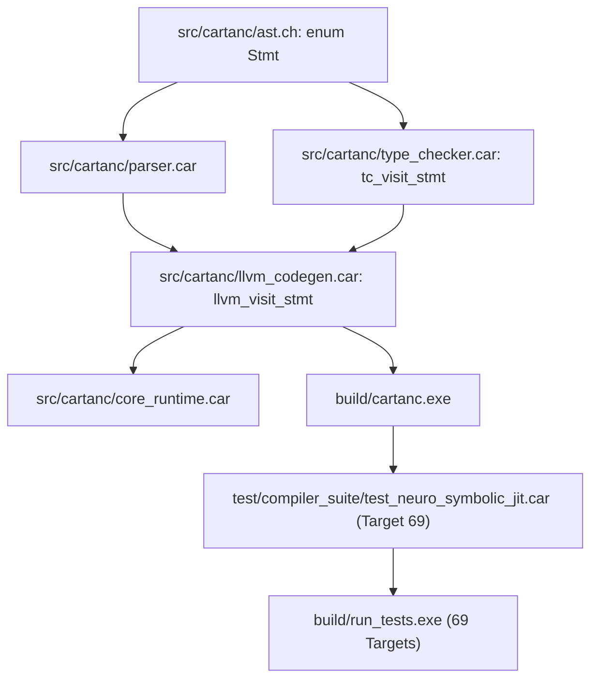

# Startup Code Review - Sprint 459

**Date**: 2026-09-28  
**Focus**: Neuro-Symbolic & High-Level Declarations (`GraphDecl`, `KnowledgeBaseDecl`, `RuleDecl`, `JitBlock`, `DataframeDecl`)  
**Reviewer**: Antigravity (Pair Programming with Rick)

---

## 1. Executive Summary & Findings
During the pre-sprint startup code review following the clean release of Sprint 458 (version `[8.416.0]`, all 68 regression targets passing), an analysis of remaining statements in `src/cartanc/ast.ch:enum Stmt`, `src/cartanc/parser.car`, and `src/cartanc/llvm_codegen.car` identified three key gaps:

1. **AST Arity & Type Mismatch (`ast.ch:enum Stmt`)**:
   - `parser.car` parses blocks for `GraphDecl` (line 612) and `KnowledgeBaseDecl` (line 629) via `parse_block(self_ptr) -> BlockStmt` (a pointer `ptr`), passing `(name: string, body: ptr)`.
   - In contrast, `src/cartanc/ast.ch` declared `GraphDecl(string, tree<ptr>)` and `KnowledgeBaseDecl(string, tree<ptr>)`.
   - This type inconsistency mirrors the `EvolveBlock`/`Spawn` issues resolved in Sprint 458 and can lead to memory layout and type verification defects.

2. **Missing JIT and DataFrame Block Lowering (`llvm_codegen.car`)**:
   - `Stmt::JitBlock` (variant `39.0`, line `162.0`) and `Stmt::DataframeDecl` (variant `37.0`, line `160.0`) are parsed cleanly in `parser.car:230` and `parser.car:740`.
   - However, neither statement has a visitor handler in `src/cartanc/llvm_codegen.car:llvm_visit_stmt` or type checking in `src/cartanc/type_checker.car:tc_visit_stmt`.

3. **Missing Neuro-Symbolic Graph & KnowledgeBase Lowering (`llvm_codegen.car`)**:
   - `Stmt::GraphDecl` (variant `29.0`, line `152.0`), `Stmt::RuleDecl` (variant `30.0`, line `153.0`), and `Stmt::KnowledgeBaseDecl` (variant `31.0`, line `154.0`) have no lowering handlers in `llvm_codegen.car:llvm_visit_stmt`, dropping declarative graph and rule logic during compilation.

---

## 2. Logical Dependency Tree

### Dependency Flow Details:
- `ast.ch`: Declares canonical statement variant signatures (`GraphDecl(string, ptr)`, `KnowledgeBaseDecl(string, ptr)`, `JitBlock(ptr)`, `DataframeDecl(string, ptr)`).
- `parser.car`: Produces AST instances matching these signatures.
- `type_checker.car`: Recursively visits statement bodies within `JitBlock`, `DataframeDecl`, `GraphDecl`, and `KnowledgeBaseDecl`, maintaining accurate lexical scopes.
- `llvm_codegen.car`: Emits structured LLVM IR sections and executes nested block statements with proper register management.
- `core_runtime.car`: Provides execution runtime support.
- Regression Suite: Verifies zero regressions across 69 targets.

---

## 3. Registered Issues
- `[ISSUE-245]`: AST Signature Mismatch for `GraphDecl` and `KnowledgeBaseDecl` in `ast.ch:enum Stmt`.
- `[ISSUE-246]`: Missing Lowering and Scoping for `JitBlock` (`39.0 || 162.0`) and `DataframeDecl` (`37.0 || 160.0`).
- `[ISSUE-247]`: Missing Lowering for `GraphDecl`, `RuleDecl`, and `KnowledgeBaseDecl` (`29.0..31.0 || 152.0..154.0`).
