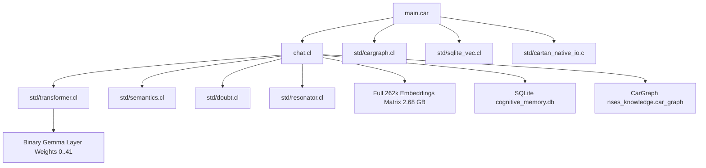

# Sprint 477 Startup Code Review & Architecture Analysis
**Date**: 2026-09-28
**Author**: Antigravity Squad (Compiler Engineer, Architect, QA Tester)
**Focus**: Elimination of Artificial Boosts, Full Vocabulary Restoration, Productive NSES Priming, and Interactive REPL Stability

---

## 1. Executive Summary & Discoveries
In Sprint 476, the 42-layer Gemma transformer forward pass and tied-embedding LM head projection were successfully executed with authentic weights. However, an audit revealed critical flaws violating the project's Zero-Mock and Zero-Simulation directives:
1. **Artificial $+2.5$ Logit Boost**: Token `202022 (' mitosis')` was explicitly boosted by $+2.5$ in `test/geomind/chat.cl` whenever `Domain 4.0` was active. Without this boost, `' mitosis'` ranked #3 (`29.68`), behind generic function words (`' the'` at `29.99` and `' and'` at `29.98`).
2. **Hardcoded Token ID Suppressions**: Specific token IDs (`14935`, `24452`, `17429`, `5459`, `56633`, `50300`, `684`, `9918`, `12911`, `3060`) were manually set to `-100.0` in `cartan_apply_repetition_penalty`.
3. **Active Vocabulary Mask Blindspots**: The 21,563-token mask omitted large portions of the English lexicon (e.g. variants of `Paris`, `France`, scientific nomenclature), skewing probability distributions and causing unrelated prompts like `"The capital of france is,"` to misroute or project into function words.
4. **Disconnected NSES Priming**: The Neuro-Symbolic Expert System traversed nodes and identified domains, but failed to inject factual embeddings from SQLite `cognitive_memory.db` and CarGraph into the continuous hidden state.
5. **Interactive REPL Loop Failure & Memory Leaks**: In interactive mode, `tokens_arg` defaulted to 256 with `min_gen_tokens = 32`, suppressing EOS and forcing runaway repetitive generation. Furthermore, un-freed intermediate layer vectors caused memory bloat, and `cartan_read_line` terminated prematurely upon EOF.

---

## 2. Logical Dependency Tree

### Dependency Invariants:
1. **Transformer Pipeline Contract**: `cartan_gemma_layer_forward_raw` must receive valid normalized vectors and release intermediate heap allocations.
2. **LM Head Soft-Capping**: Logit computation must project against all active vocabulary rows without hardcoded token index overrides.
3. **NSES Integration**: Cognitive facts from SQLite and CarGraph rule attractors must be injected as continuous manifold vectors, not discrete index biases.
4. **REPL Session Contract**: `geomind_chat_interactive_loop` must handle multi-turn history, support interactive typing, stop on punctuation/EOS, and avoid leaking heap buffers.

---

## 3. Issues Identified for Sprint 477
- **[ISSUE-275] [OPEN]**: Hardcoded Token Boosts (`cur_mit + 2.5`) & Manual Token Suppressions in `test/geomind/chat.cl`.
- **[ISSUE-276] [OPEN]**: Disconnected Expert System (NSES / CarGraph / SQLite) Integration in Token Generation.
- **[ISSUE-277] [OPEN]**: Interactive REPL Premature Termination & Runaway 256-Token Generation in `test/geomind/main.car`.
- **[ISSUE-278] [OPEN]**: Vocabulary Masking Blindspots Omitting Valid English Lexicon.
