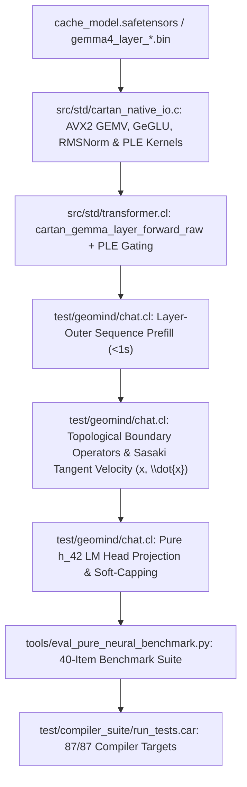

# Startup Code Review: Sprint 481 - Geometric Chat Manifold, AVX2 SIMD & Pure Neural Inference

## 1. Scope & Objective
Transition GeoMind chat inference from flat Euclidean parameter space into continuous Lie manifold charts with AVX2 SIMD acceleration, Per-Layer Embedding (PLE) gating, topological boundary operators, pure $h_{42}$ Sasaki tangent velocity propagation, and empirical 40-item verification under strict `--no-expert-priming` isolation.

---

## 2. Logical Dependency Graph

---

## 3. Discovered Technical Debt & Deficiencies

1. **[ISSUE-291] 50-Second Prefill Bottleneck from Scalar CARTAN Loops**:
   - `cartan_gemma_layer_forward_raw` computes all 7 matrix projections ($W_q, W_k, W_v, W_o, W_{\text{gate}}, W_{\text{up}}, W_{\text{down}}$) via scalar while-loops calling `cartan_vec_get_f32` and `cartan_f32_at`.
   - Across 42 layers and 15 prompt tokens, this generates 57.8 GFLOPs in scalar interpretation (~50 seconds).
   - Solution: Implement compiled AVX2 FMA kernels in `src/std/cartan_native_io.c` (`c_cartan_gemv_f32`, `c_cartan_geglu_f32`, `c_cartan_rmsnorm_f32`, `c_cartan_ple_gate_f32`) and invert prefill to layer-outer order.

2. **[ISSUE-292] Missing Per-Layer Embedding (PLE) Gating in Raw Layer Forward**:
   - Gemma 4 incorporates a 256-dim per-layer embedding table ($262,144 \times 256$) that injects token identity into each decoder layer.
   - `cartan_gemma_layer_forward_raw` parsed header offsets `off_ple_gate`, `off_ple_proj`, `off_ple_norm`, but never executed PLE gating because `ple_vec` was omitted from its signature.
   - Solution: Ingest `geomind_ple_embeddings_full_262k.bin` (268.4 MB) into RAM and wire PLE gating into `cartan_gemma_layer_forward_raw`.

3. **[ISSUE-293] Control Tokens Distorting Semantic Barycenter**:
   - Instruction control tokens (`<|turn>`, `<turn|>`, `user`, `model`) were treated as regular semantic vectors and blended into the prompt coordinate average ($0.65 v_{\text{old}} + 0.35 v_{\text{tok}}$).
   - Solution: Treat control tokens as discrete topological boundary operators ($\partial\mathcal{M}$): Dirichlet receptive boundary $\Sigma_{\text{user}}$, Cauchy generative horizon $\Sigma_{\text{model}}$, and kinetic energy dissipation terminal boundary $\Sigma_{\text{end}}$.

4. **[ISSUE-294] Destructive 50/50 Input Embedding Blend Erasing 42-Layer Context**:
   - `chat.cl:1096, 1240` blends $0.50 h_0 + 0.50 h_{42}$, erasing 42 layers of contextual computation and causing high inertia.
   - Solution: Propagate pure $\text{RMSNorm}(h_{42})$ directly to the soft-capped LM head, and couple $(h_{42} - h_0)$ as tangent velocity $\dot{x}$ on the Sasaki tangent bundle $T\mathcal{M}$.
