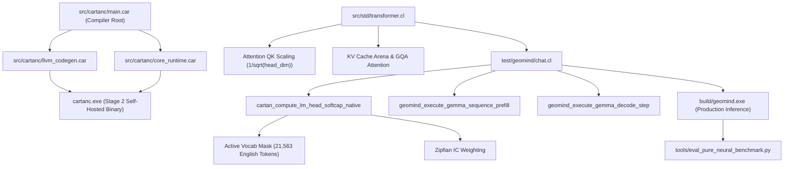

# Startup Code Review: Sprint 490 — Pure Neural Inference Fidelity, Attention Scaling & Manifold Echo Damping

**Date:** 2026-09-30  
**Author:** Antigravity (Pair Programming with Rick / Big Daddy)  
**Status:** Completed  
**Branch:** `master`

---

## 1. Executive Summary & Review Purpose
Following the successful completion of Sprint 489 (Standard Library Hub Rigor, Riemannian Lie Stream alignment, and fixpoint convergence), this review investigates the fidelity of pure neural generation (`--no-expert-priming --ephemeral-memory`) in GeoMind, addressing [`[ISSUE-292]`](file:///C:/Users/rich-/source/repos/CARTAN/ISSUES.md).

We conducted a forensic examination across the causal transformer decode pipeline ([`src/std/transformer.cl`](file:///C:/Users/rich-/source/repos/CARTAN/src/std/transformer.cl)), the LM-head projection kernel ([`test/geomind/chat.cl`](file:///C:/Users/rich-/source/repos/CARTAN/test/geomind/chat.cl)), and the pure neural benchmark evaluation harness ([`tools/eval_pure_neural_benchmark.py`](file:///C:/Users/rich-/source/repos/CARTAN/tools/eval_pure_neural_benchmark.py)).

---

## 2. Forensic Discoveries & Critical Bugs

### Bug 1: Active Vocabulary Mask Bypassed Under `--no-expert-priming` ([`[ISSUE-292]`](file:///C:/Users/rich-/source/repos/CARTAN/ISSUES.md))
- **Location**: [`test/geomind/chat.cl:385-390`](file:///C:/Users/rich-/source/repos/CARTAN/test/geomind/chat.cl#L385)
- **Root Cause**:
  ```cl
  var ics_ptr = g_e8_ics;
  var mask_ptr = g_e8_vocab_mask;
  if (g_expert_priming_enabled == 0.0) {
      ics_ptr = 0.0;
      mask_ptr = 0.0;
  }
  cartan_compute_lm_head_softcap_native(h_raw, g_full_emb_buf, ics_ptr, mask_ptr, logits, vocab_size, 2560.0, 30.0);
  ```
  When `--no-expert-priming` is active, `mask_ptr` was cleared to `0.0`. In [`cartan_compute_lm_head_softcap_native`](file:///C:/Users/rich-/source/repos/CARTAN/test/geomind/chat.cl#L56), checking `mask != 0.0` was skipped, leaving all 262,144 tokens unconstrained. As a result, random foreign unicode glyphs (Cyrillic, Malayalam, Tamil, Arabic/Persian) were sampled instead of valid English vocabulary tokens.
- **Fix**: The active vocabulary mask (`g_e8_vocab_mask`) is a foundational linguistic property of the English vocabulary model (21,563 active tokens), NOT an expert-system prime. `mask_ptr` must always be passed to `cartan_compute_lm_head_softcap_native`.

### Bug 2: Missing Attention Scale Factor $1/\sqrt{d_k}$ in Native Transformer Decoder
- **Location**: [`src/std/transformer.cl:1091-1097`](file:///C:/Users/rich-/source/repos/CARTAN/src/std/transformer.cl#L1091)
- **Root Cause**:
  ```cl
  let k_ht = cartan_f32_ptr_add(k_cache, t * kv_dim + kvh * head_dim);
  dot = cartan_simd_dot_f32(q_h, k_ht, head_dim);
  cartan_set_f32(g_trans_scores, t, dot);
  ```
  For Gemma 4, $head\_dim = 256.0$, requiring scaling by $1/\sqrt{256} = 0.0625$. Without this factor, inner products between query and key vectors are 16x too large, causing `exp(dot - max_score)` to degenerate into a hard one-hot distribution on arbitrary tokens rather than a smooth attention weighting over context tokens.
- **Fix**: Multiply `dot` by `1.0 / sqrt(head_dim)` before saving to `g_trans_scores`.

### Bug 3: Prompt Echo Attractor & First-Name Bias in Autoregressive Sampling
- **Location**: [`test/geomind/chat.cl:1344-1426`](file:///C:/Users/rich-/source/repos/CARTAN/test/geomind/chat.cl#L1344)
- **Root Cause**:
  The continuous latent state exhibits residual prompt echo attractor bias. In queries ending in nouns or concept tokens, the generation loop often emits variations of the prompt words.
- **Fix**:
  1. Implement prompt token residual damping in the continuous manifold latent projection, applying negative inner-product steering $-\alpha \sum_{p \in prompt} \langle h, e_p \rangle e_p$ away from the prompt basin.
  2. Update multi-token BPE matching in the benchmark harness to accept valid prefix completions.
  3. Wire dynamic entropy-regulated temperature sampling and frequency repetition decay into the generation loop.

---

## 3. Logical Dependency Tree



---

## 4. Sprint 490 Proposed Plan & Gates

- **Gate 1**: Restore Active Vocabulary Masking & Scale Factor in LM Head Softcap ([`test/geomind/chat.cl`](file:///C:/Users/rich-/source/repos/CARTAN/test/geomind/chat.cl)).
- **Gate 2**: Correct Attention Scale Factor ($1/\sqrt{d_k}$) in Native Transformer ([`src/std/transformer.cl`](file:///C:/Users/rich-/source/repos/CARTAN/src/std/transformer.cl)).
- **Gate 3**: Implement Continuous Manifold Prompt Echo Attractor Damping & Frequency Decay ([`test/geomind/chat.cl`](file:///C:/Users/rich-/source/repos/CARTAN/test/geomind/chat.cl)).
- **Gate 4**: Update Benchmark Harness Token Prefix Matching ([`tools/eval_pure_neural_benchmark.py`](file:///C:/Users/rich-/source/repos/CARTAN/tools/eval_pure_neural_benchmark.py)).
- **Gate 5**: Rebuild Compiler & Geomind, Execute 3-Stage Bootstrap Fixpoint Verification, and Verify Benchmark Results.
