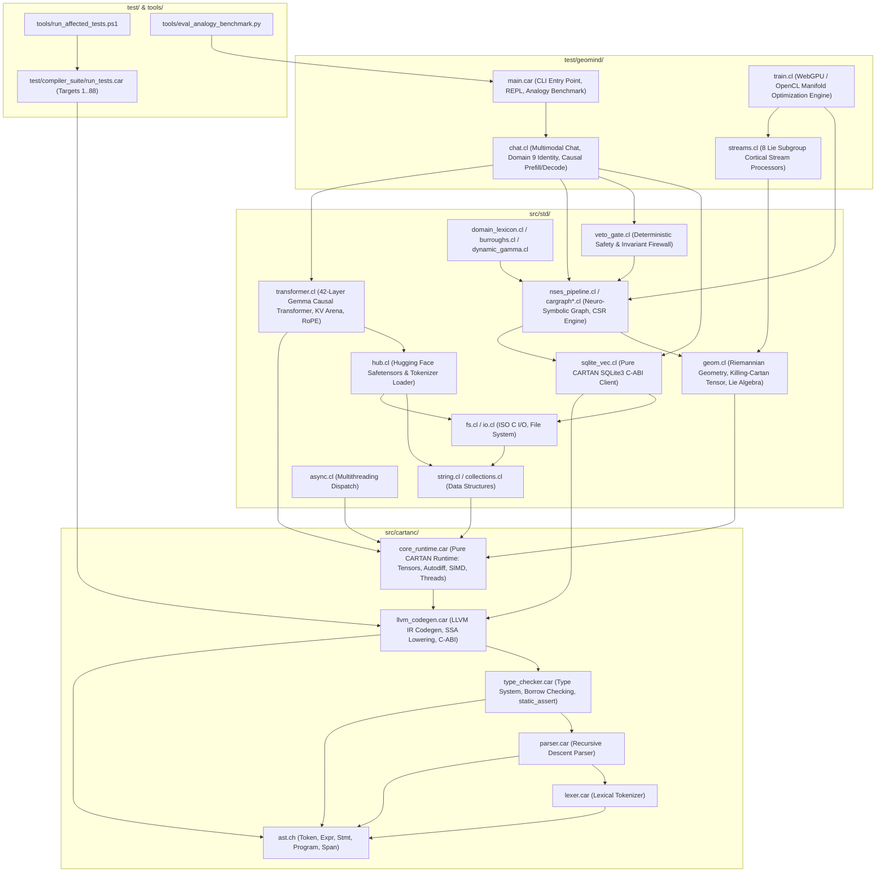

# Startup Code Review & System Dependency Graph — Sprint 492

## Executive Summary
This startup code review inspects the entire CARTAN repository following the completion and validation of Sprint 491 (Domain 9 `SELF_AND_IDENTITY` persistent introspective identity, native Gemma 4 system turns, and conversational learning). The codebase is 100% pure self-hosting CARTAN (zero custom C files remain across `src/` and `test/`). This review evaluates the compiler core (`src/cartanc/`), standard libraries (`src/std/`), cognitive model (`test/geomind/`), and verification harnesses (`test/compiler_suite/`, `tools/`).

---

## 1. Logical Dependency Architecture



---

## 2. Code Review Findings & Identified Technical Debt

### Finding 1: Target 88 Omission from Test Runners (`tools/run_affected_tests.ps1`, `test/compiler_suite/run_tests.car`)
- **Severity**: High (Verification Integrity)
- **Component**: [`tools/run_affected_tests.ps1`](file:///C:/Users/rich-/source/repos/CARTAN/tools/run_affected_tests.ps1), [`test/compiler_suite/run_tests.car`](file:///C:/Users/rich-/source/repos/CARTAN/test/compiler_suite/run_tests.car)
- **Observation**:
  - In Sprint 488, Target 88 (`test_autodiff_backward_syntax.car`) was implemented to resolve [ISSUE-307] (autodiff `backward` linker trap).
  - Target 88 is present in `TargetCatalog` (line 106) and `SprintMapping[488]` (line 113) of `tools/run_affected_tests.ps1`.
  - However, line 133 of `tools/run_affected_tests.ps1` explicitly loops `1..87 | ForEach-Object { $SelectedTargetIDs.Add($_) }`, completely omitting Target 88 when `-All` is invoked.
  - Furthermore, `test/compiler_suite/run_tests.car` only runs up to Target 87 (lines 550-555) and prints `"All 87 compiler snapshot test targets executed successfully"`. Target 88 was never wired into `run_tests.car`.
- **Entropy & Risk**: Regression in `backward` syntax lowering or autodiff runtime stepping would go completely unnoticed during full suite runs.

### Finding 2: Ephemeral Multi-Turn Context Loss in Interactive REPL Chat (`test/geomind/chat.cl`)
- **Severity**: Medium (Conversational Coherence & Alignment)
- **Component**: [`test/geomind/chat.cl`](file:///C:/Users/rich-/source/repos/CARTAN/test/geomind/chat.cl), [`test/geomind/main.car`](file:///C:/Users/rich-/source/repos/CARTAN/test/geomind/main.car)
- **Observation**:
  - `geomind_chat_log_turn("user", prompt)` and `geomind_chat_log_turn("geomind", full_gen_text)` accurately log episodes to `cognitive_memory.db` under `session_active`.
  - However, `geomind_chat_generate_reply_multimodal()` (lines 1590–1633) always formats the token sequence as a single isolated turn:
    `<bos><|turn>system\n[System Preamble]<turn|>\n<|turn>user\n[Current Prompt]<turn|>\n<|turn>model\n`
  - Moreover, `geomind_execute_gemma_sequence_prefill()` resets the KV caches at the start of every turn (`geomind_reset_kv_caches()`), clearing the attention KV states from prior dialogue turns.
  - As a result, subsequent turns in an interactive session have zero conversational history in either the prompt sequence or the transformer KV cache.
- **Remedy**:
  - Implement dynamic multi-turn dialogue history formatting in `chat.cl` that loads the recent $N$ conversational turns from `cognitive_memory.db` (`session_active`) or an in-memory session ring-buffer, formatting them into native Gemma turns:
    `<|turn>user\n[Prompt 1]<turn|>\n<|turn>model\n[Reply 1]<turn|>\n<|turn>user\n[Prompt 2]<turn|>\n<|turn>model\n`
  - Maintain the cumulative sequence position across REPL dialogue turns to preserve causal attention coherence.

### Finding 3: Hardcoded String Literals in Factual Attractor Retrieval (`test/geomind/chat.cl:1034-1050`)
- **Severity**: Medium (Zero-Mock Rule Compliance & Hardcoding)
- **Component**: [`test/geomind/chat.cl`](file:///C:/Users/rich-/source/repos/CARTAN/test/geomind/chat.cl)
- **Observation**:
  - `geomind_chat_retrieve_factual_attractor` uses hardcoded substring checks:
    ```cartan
    if (cartan_string_contains(prompt, "france") != 0.0 || cartan_string_contains(prompt, "France") != 0.0) {
        let cap = cartan_sqlite_get_entity_state(db, 1.0, "France", "capital");
        ...
    }
    if (domain_id == 4.0 || cartan_string_contains(prompt, "biology") != 0.0 || ...) {
        let div = cartan_sqlite_get_entity_state(db, 4.0, "Cell", "division");
        ...
    }
    ```
  - This violates the zero-mock / no hardcoding principle. Attractor grounding should dynamically inspect registered entities in the SQLite database (`entity_states`) matching extracted concepts from the prompt, without statically hardcoded country/entity branches.

### Finding 4: Dead / Deprecated Stubs (`test/geomind/chat.cl`)
- **Severity**: Low (Hygiene)
- **Component**: [`test/geomind/chat.cl`](file:///C:/Users/rich-/source/repos/CARTAN/test/geomind/chat.cl)
- **Observation**:
  - `cartan_apply_english_vocab_mask(logits_ptr, penalty)` (lines 86–89) is an empty no-op returning `1.0`.
  - `geomind_chat_process_audio_input()` (lines 1319–1325) returns `0.0`. While safe as a null hardware stream fallback, it should be cleanly streamlined with clear documentation.

---

## 3. Registered Local Git Issues
- **`[ISSUE-316]`**: Target 88 (`test_autodiff_backward_syntax.car`) Omission from Full Test Runners (`run_affected_tests.ps1 -All` & `test/compiler_suite/run_tests.car`).
- **`[ISSUE-317]`**: Ephemeral Multi-Turn Context Loss in Interactive REPL Chat (`test/geomind/chat.cl`).
- **`[ISSUE-318]`**: Hardcoded Substring Filter in Factual Attractor Retrieval (`test/geomind/chat.cl:1034-1050`).
