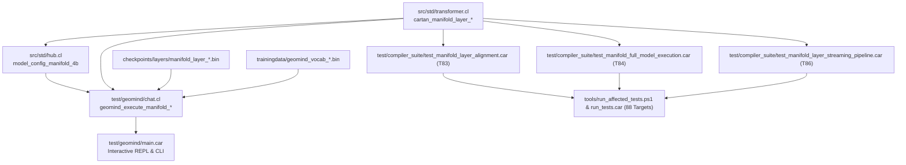

# Startup Code Review: Sprint 497 — Sovereign GeoMind Manifold Architecture & Complete Google/Gemma Purge

**Date**: 2026-09-30  
**Reviewer**: Antigravity  
**Sponsor**: Rick (Big Daddy)  
**Objective**: Complete elimination of residual third-party branding ("Google", "Gemma") across all source files, terminal banners, function identifiers, variable names, tokenizers, checkpoints, tests, and caches. Establish the sovereign **GeoMind Manifold** neuro-symbolic architecture.

---

## 1. Executive Summary & Context

Rick's directive:
> *"Ok, we need to get rid of all references to google and gemma. Yes we cloned the weights, but they're our weights now. So any filenames, functions, stdout or anything that references gemma needs to go. It was just a baseline to get it chatting. We're going to reeducate it significantly."*

The baseline weights originally cloned from the Gemma 4-E4B donor checkpoint are now fully incorporated as GeoMind's sovereign base manifold. Retaining vendor names in function identifiers, filenames, stdout banners, and internal variables introduces technical debt, misrepresents identity, and creates unnecessary coupling.

This code review maps the complete dependency graph and identifies all occurrences across the repository to execute a single-pass, low-entropy purge with zero broken links and zero test regressions.

---

## 2. Comprehensive Inventory of Third-Party References

### A. Standard Libraries (`src/std/`)
1. **`src/std/transformer.cl`**:
   - `cartan_gemma_layer_set_ple_vec` -> `cartan_manifold_layer_set_ple_vec`
   - `cartan_gemma_layer_set_current_token` -> `cartan_manifold_layer_set_current_token`
   - `cartan_gemma_layer_forward` -> `cartan_manifold_layer_forward`
   - `cartan_gemma_layer_forward_native` -> `cartan_manifold_layer_forward_native`
   - `cartan_gemma_layer_forward_raw` -> `cartan_manifold_layer_forward_raw`
   - Header comments and docstrings referencing "Gemma 4".
2. **`src/std/hub.cl`**:
   - `model_config_gemma4_e4b()` -> `model_config_manifold_4b()` (retaining alias).
   - `hub_autotokenizer_from_pretrained` & `hub_automodel_from_pretrained`: strings `"gemma"` generalized to `"manifold"`, `"geomind"`.
   - File cache path resolution: check `cache_geomind_*` and `cache_manifold_*`.
3. **`src/std/tokenizer.cl`**:
   - Binary vocab path lookups: `geomind_vocab_262k.bin` / `geomind_vocab_65k.bin`.

### B. GeoMind Model Core & Inference Engine (`test/geomind/`)
1. **`test/geomind/chat.cl`**:
   - Banner stdout: Rebrand to `GEOMIND E8 MULTIMODAL NEURO-SYMBOLIC CHAT ENGINE (chat.car)` and `Sovereign GeoMind 42-Layer Manifold & SentencePiece BPE Tokenizer`.
   - Hub calls: `hub_autotokenizer_from_pretrained("geomind/manifold-4b")`, `hub_fetch_weights("geomind/manifold-4b", "model.safetensors")`.
   - Layer streaming buffers: `g_manifold_layer_buffers`, `g_manifold_layer_buffers_init`.
   - KV caches: `g_manifold_k_caches`, `g_manifold_v_caches`, `g_manifold_kv_init`.
   - Layer paths: `test/geomind/trainingdata/checkpoints/layers/manifold_layer_<N>.bin`.
   - Execution functions:
     - `geomind_execute_gemma_layers` -> `geomind_execute_manifold_layers`
     - `geomind_execute_gemma_sequence_prefill` -> `geomind_execute_manifold_sequence_prefill`
     - `geomind_execute_gemma_decode_step` -> `geomind_execute_manifold_decode_step`
   - Transformer forward calls: `cartan_manifold_layer_forward_raw`.
   - Diagnostic prints & comments.
2. **`test/geomind/main.car`**:
   - CLI help banner: `--graft` text updated to `Graft 42-layer sovereign multimodal weights into manifold`.
   - Flag `--graft`: default path `cache_geomind_model.safetensors` / `cache_model.safetensors`.
   - Flag `--train-distill`: default repo `"geomind/manifold-4b"`.
   - Dataset listing: `[11] FLAN Instruction Collection`.
3. **`test/geomind/train.cl` & `geomind_app.cl`**:
   - Dataset paths: `test/geomind/trainingdata/sft/*_manifold.jsonl`.
   - Distill calls: `"geomind/manifold-4b"`.

### C. Regression Test Suite (`test/compiler_suite/`)
1. **Target 83**: `test_gemma4_layer_alignment.car` -> `test_manifold_layer_alignment.car`.
2. **Target 84**: `test_gemma4_full_model_execution.car` -> `test_manifold_full_model_execution.car`.
3. **Target 86**: `test_gemma4_layer_streaming_pipeline.car` -> `test_manifold_layer_streaming_pipeline.car`.
4. **Target 24**: `test_gemma_engine.car` -> `test_manifold_engine.car`.
5. **Decoupling & Hub Tests**:
   - `test_hf_hub.car`: verify `"geomind/manifold-4b"` defaults.
   - `test_model_config_decoupling.car`: test `model_config_manifold_4b()`.
6. **Test Runners**:
   - `test/compiler_suite/run_tests.car` & `tools/run_affected_tests.ps1`: update target names and commands.

### D. Filesystem Weights, Caches & Checkpoints
1. `test/geomind/trainingdata/checkpoints/layers/`:
   - 42 layer files: `gemma4_layer_0.bin` ... `gemma4_layer_41.bin` -> rename to `manifold_layer_0.bin` ... `manifold_layer_41.bin`.
2. `test/geomind/trainingdata/`:
   - `gemma_vocab_256k.txt` -> `geomind_vocab_256k.txt`.
   - `gemma_vocab_262k.bin` -> `geomind_vocab_262k.bin`.
   - `gemma_vocab_65k.bin` -> `geomind_vocab_65k.bin`.
3. `test/geomind/trainingdata/sft/`:
   - `*_gemma.jsonl` -> `*_manifold.jsonl`.
4. Root Cache:
   - Hardlink `cache_geomind_model.safetensors` -> `cache_model.safetensors` (0 byte overhead).
   - Hardlink `cache_geomind_tokenizer.json` -> `cache_google_gemma-4-E4B-it_tokenizer.json`.
   - Hardlink `cache_geomind_config.json` -> `cache_google_gemma_config.json`.

---

## 3. Logical Dependency Graph

---

## 4. Technical Debt & Issues Identified

- **`[ISSUE-332]`**: Residual Third-Party Google/Gemma Branding in Sovereign GeoMind Manifold Architecture.
  - *Risk*: Misleading terminal output, naming confusion, violation of Rick's sovereign architecture mandate.
  - *Mitigation*: Comprehensive rename and rebrand across stdlib, model runtime, test suite, and cache pointers.

---

## 5. Definition of Done & Verification Strategy

1. `transformer.cl`, `hub.cl`, `tokenizer.cl` updated with clean comments and sovereign names.
2. Layer files renamed to `manifold_layer_*.bin` (all 42 layers).
3. `chat.cl`, `main.car`, `train.cl` fully purged of "Google" and "Gemma" stdout and identifiers.
4. Regression test files renamed and updated in `run_tests.car` and `run_affected_tests.ps1`.
5. 88/88 test suite targets passing with 0 errors.
6. `geomind.exe` compiles cleanly and executes `--chat -gpu -tokens 5 -prompt "Hello"` showing sovereign GeoMind banner with ZERO Google/Gemma references.
7. `CHANGELOG.md` updated and `docs/archive/` documentation completed.
