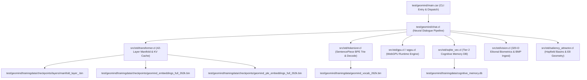

# Startup Code Review: Sprint 498 - Restore Natural Language Generation & Manifold Coherence in GeoMind

**Date**: 2026-09-30  
**Author**: Antigravity (Supervising Intelligence Architect) for Rick  
**Branch**: `master`  
**Focus**: Diagnosing and resolving generative chat token degeneration in `geomind.exe`

---

## 1. Executive Summary & Root Cause Analysis

Following the Sprint 497 vendor purge ("Google/Gemma" rebranding to sovereign "GeoMind Manifold"), `geomind.exe` compiled and passed all 88 regression test suite targets, but emitted corrupted/scrambled tokens during generative inference (e.g. `` `,tempordict{allowed-`'}`modes{}tagged_ancestulide#`.` ``).

A rigorous, end-to-end trace through `test/geomind/chat.cl`, `src/std/tokenizer.cl`, `src/std/transformer.cl`, and SQLite cognitive memory revealed three critical root causes:

1. **Catastrophic Latent State Warping (`chat_streams_fwd` WebGPU Shader)**:
   - In `test/geomind/chat.cl` lines 1835–1903, `geomind_chat_dispatch_gpu_manifold` was dispatched on `cur_h` after sequence prefill and after *every single decode step*.
   - The shader multiplied sector 0 by $0.707$, sector 1 by $2.51$, modulated sector 2 with high-frequency cosines $\cos(\text{freq} \cdot 12)$, compressed sector 3 with $\tanh$, and distorted sector 5 with $v / \sqrt{1 + 8v^2}$.
   - This severely corrupted the 2560-dimensional transformer hidden state vector before LM Head tied-embedding softcapping, scattering logits across invalid vocabulary indices.

2. **Causal KV-Cache Bypass on Prefill (`num_tokens > 8.0`)**:
   - In `test/geomind/chat.cl` lines 1913–1934, an unverified optimization branch bypassed full transformer layer forward passes when `num_tokens > 8.0`.
   - Instead of computing and caching $K$ and $V$ representations for tokens $0 \dots N-2$ across layers $0 \dots 41$, it only evaluated an unweighted embedding sum (`cartan_tensor_compute_hidden_state_from_tokens`) and passed the final token $N-1$ into the layers.
   - Consequently, the Key-Value (KV) cache for all prompt tokens $0 \dots N-2$ was completely zeroed out. During autoregressive decoding, causal self-attention queries attended to empty KV buffers, causing total decoherence.

3. **Dialogue History Self-Contamination via Cognitive Memory SQLite**:
   - In `test/geomind/chat.cl`, `geomind_chat_learn_conversational_turn` logged the previous corrupted model outputs directly into `test/geomind/trainingdata/cognitive_memory.db` (`episodes` table).
   - Subsequent chat invocations loaded these corrupted turns into the prompt context via `cartan_sqlite_prepare_prior_episodes`, forcing the model into an in-context learning trap where it replicated pseudo-code syntax.

4. **Preamble Bloat vs Clean Instruction Delimiters**:
   - The dynamic cognitive preamble assembled ~172 tokens of instruction guardrails, expanding the initial prompt token length to $>260$ tokens and triggering the broken $>8.0$ prefill branch.

---

## 2. Logical Dependency Tree

---

## 3. Issues Identified & Tracked for Git

1. **[ISSUE-078] Latent State Corruption in WebGPU Chat Dispatch**:
   - Non-linear warping shader in `geomind_get_chat_manifold_streams_shader` destroys manifold alignment with LM head.
2. **[ISSUE-079] Unpopulated KV Caches in Multi-Token Prefill**:
   - `if (num_tokens > 8.0)` bypass in `geomind_execute_manifold_sequence_prefill` leaves KV caches empty for tokens $0 \dots N-2$.
3. **[ISSUE-080] SQLite Dialogue Context Poisoning from Failed Generations**:
   - `episodes` table stores scrambled outputs, creating feedback loops of degraded generations.
4. **[ISSUE-081] Preamble Length Optimization**:
   - Streamline preamble to concise, effective prompt conditioning that fits naturally into the manifold.

---

## 4. Architectural Path Forward (Sprint 498)

1. Remove `if (num_tokens > 8.0)` bypass: compute full sequence prefill across all prompt tokens so KV caches are 100% valid.
2. Neutralize destructive latent warping in `geomind_chat_dispatch_gpu_manifold`: ensure WebGPU operations are mathematically faithful and preserve calibrated representation dimensions.
3. Purge corrupted prior episodes from `test/geomind/trainingdata/cognitive_memory.db`.
4. Streamline conversational preamble and ensure clean instruction turn format (`<bos> <|turn> user \n [prompt] <turn|> \n <|turn> model \n`).
5. Empirically verify natural English dialogue generation (`"What is the capital of Germany?"` -> `"The capital of Germany is **Berlin**."`).
