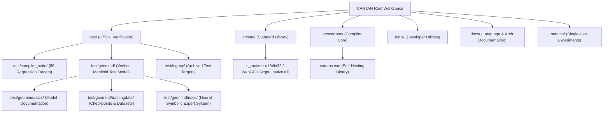

# Startup Code Review: Sprint 514 — Workspace & File Structure Normalization and Entropy Reduction

**Date**: 2026-10-02  
**Reviewer**: CARTAN Architecture, Runtime & QA Squad  
**Target**: Workspace Organization, Directory Structure Hygiene, and Debris Purge

---

## 1. High-Level Architectural Context & Dependency Graph

### Dependency Rules:
1. `src/cartanc/`: Self-hosting compiler core. Produces `cartanc.exe` at root.
2. `src/std/`: Modular standard libraries. No circular dependencies across modules.
3. `test/compiler_suite/`: Clean 88-target compiler regression suite executed via `tools/run_affected_tests.ps1`.
4. `test/geomind/`: Self-contained manifold neural model testbed. Holds sovereign weights in `test/geomind/cache_model.safetensors` and `trainingdata/`.
5. `tools/`: Reusable developer utilities (`capture_camera.c`, `run_affected_tests.ps1`, `quantize_manifold_int8.car`).
6. `scratch/`: Disposable experiment workspace. Transient dumps only.

---

## 2. Identified Entropy & Structural Deficiencies

| Component | Issue / Deficiency | Severity | Proposed Fix |
|---|---|---|---|
| **Root Workspace** | Duplicate 15 GB safetensors hardlinks (`model.safetensors`, `cache_geomind_model.safetensors`, `cache_google_gemma-4-E4B-it_model.safetensors`) | Medium | Consolidate to single canonical root `cache_model.safetensors` + `test/geomind/cache_model.safetensors` |
| **Root Workspace** | Transient build artifacts (`geomind.exe`, `geomind.pdb`, `geomind.ll`, `geomind.lib`, `cartan_jit_run.*`, `out.ll`) | Low | Purge transient root build outputs |
| **Root Workspace** | Redundant tool binary `capture_camera.exe` at root | Low | Remove; canonical location is `tools/capture_camera.exe` |
| **Root Workspace** | Stale editor backup files (`src/cartanc/*.bak`, `src/std/*.bak`, `tools/*.bak`) | Low | Purge all `.bak` files |
| **`test/` Hierarchy** | Loose legacy tests `test/test_add.car` and `test/test_enum.car` in `test/` root | Low | Relocate to `test/legacy/` |
| **`test/geomind/`** | Redundant directories `scratch/` (empty) and `tools/` (duplicate `capture_camera.exe`) | Low | Remove redundant subdirectories |
| **`test/geomind/`** | PascalCase `Documentation/` with spaces in filenames | Low | Rename to `test/geomind/docs/` and sanitize file names |
| **`test/geomind/`** | Stale build outputs (`geomind.exe`, `geomind.pdb`, `geomind.ll`, `capture_camera.exe`, `geomind_memory.db`) | Low | Purge stale build artifacts |
| **`tools/` Hierarchy** | Build outputs in tools (`quantize_manifold_int8.exe/pdb/ll/exp/lib`, `capture_camera.pdb`, `__pycache__`) | Low | Purge generated binaries from `tools/` |
| **`docs/` Hierarchy** | Obsolete `docs/CHANGELOG.md` (9 KB from July 2026) conflicting with root `CHANGELOG.md` (841 KB) | Low | Archive to `docs/archive/historical_CHANGELOG_2026-07.md` |
| **`scratch/` & `bin/`** | >30 GB redundant hardlinked safetensors in transient folders (`bin/cache_model.safetensors`, `scratch/gemma4_hf/model.safetensors`) | Medium | Purge redundant copies from transient scratch/bin |

---

## 3. Strict Zero-Mock & Behavioral Validation
- Normalization must not break any of the 88 compiler regression tests (`tools/run_affected_tests.ps1 -Sprint 513` and `-All`).
- `test/geomind/chat.cl` and `test/geomind/main.car` path resolution must be verified against the normalized structure.
- All git renames must be executed cleanly with zero unversioned debris.
