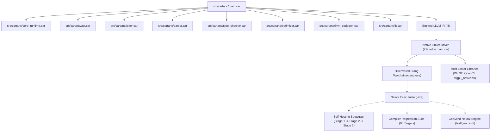

# Startup Code Review: Sprint 516 - Native Standalone Compiler Linker Driver (Zero-Python Toolchain)

**Date**: 2026-10-02  
**Sprint**: 516  
**Focus**: Native Standalone Compiler Toolchain, Elimination of External Python Wrapper, Frontend Cleanliness & 3-Stage Bootstrap Parity  

---

## 1. Executive Summary & Big Picture
CARTAN is mandated to be a standalone, self-hosting programming language. Currently, `src/cartanc/main.car` emits LLVM IR (`.ll`) and then shells out to `python tools/zig_wrapper.py` to link the native executable. This incurs process startup penalties (~200–400 ms per build), introduces an external Python runtime dependency, and couples the build to hardcoded machine-specific directory paths in `zig_wrapper.py`.

In this code review, we analyze the complete toolchain invocation pipeline, audit frontend noise, establish the logical dependency graph, identify newly discovered technical debt (`[ISSUE-369]`, `[ISSUE-370]`), and define the lowest-entropy native CARTAN linker driver.

---

## 2. Logical Dependency Tree

### Dependency Analysis:
1. `src/cartanc/main.car` is the root coordinator of all frontend passes.
2. It relies on `core_runtime.car` for strings (`cartan_string_concat`, `cartan_string_eq`, `cartan_string_replace`), file I/O (`cartan_file_exists`, `cartan_read_file`, `cartan_write_file`), and environment access (`cartan_getenv`).
3. External dependency `tools/zig_wrapper.py` acts as an unnecessary intermediate layer between CARTAN and Clang. Eliminating it makes CARTAN fully self-contained.

---

## 3. Discovered Technical Debt & Issues
1. **[ISSUE-369] External Python Linker Dependency in Standalone Compiler**:
   - `src/cartanc/main.car:518`: calls `python tools/zig_wrapper.py`.
   - `tools/zig_wrapper.py`: hardcodes absolute paths (`C:\Program Files (x86)\Intel\oneAPI\2025.3\...`, `C:\Program Files\NVIDIA GPU Computing Toolkit\...`, `C:\Users\rich-\source\repos\CARTAN\lib`).
   - Impact: Build latency overhead, environmental fragility, two-language violation.
2. **[ISSUE-370] Diagnostic Trace Pollution in Compiler Frontend**:
   - `src/cartanc/main.car:96, 144, 150, 160, 168, 172`: spams `[DEBUG include] raw_path=...`, `[DEBUG lex]...` on every AST include during standard compilation.
   - Impact: Pollutes build logs, obscures genuine warnings and errors.

---

## 4. Implementation Strategy & Safeguards
1. **Toolchain Resolution (`cartan_resolve_compiler`)**:
   - Check `CARTAN_CLANG` environment variable.
   - Check canonical installation directories:
     - `C:/Program Files (x86)/Intel/oneAPI/compiler/latest/bin/compiler/clang.exe`
     - `C:/Program Files (x86)/Intel/oneAPI/2025.3/bin/compiler/clang.exe`
     - `C:/Program Files/LLVM/bin/clang.exe`
     - Fallback to `"clang"`.
2. **Library Search Resolution**:
   - Add `-Llib` and `-L../lib` dynamically.
   - Check `%CUDA_PATH%/lib/x64` or default to `C:/Program Files/NVIDIA GPU Computing Toolkit/CUDA/v13.2/lib/x64`.
   - Check canonical oneAPI library directories.
3. **Assemble Linker Command in pure CARTAN**:
   - Assemble full MSVC-compatible command with `/FORCE:MULTIPLE`, `/STACK:67108864`, `-mavx2 -mfma`, `-DCARTAN_GPU_RUNTIME_LINKED`, and system libraries.
   - Execute via native `system(cmd)`.
4. **Clean Frontend Logging**:
   - Remove lines 96, 144, 150, 160, 168, 172 debug prints.
5. **Rigorous 3-Stage Bootstrap**:
   - Compile Stage 1 with root `cartanc.exe`.
   - Compile Stage 2 with Stage 1.
   - Compile Stage 3 with Stage 2.
   - Verify SHA-256 fixpoint parity between Stage 2 and Stage 3 `.ll` and promote Stage 2 to root `cartanc.exe`.
