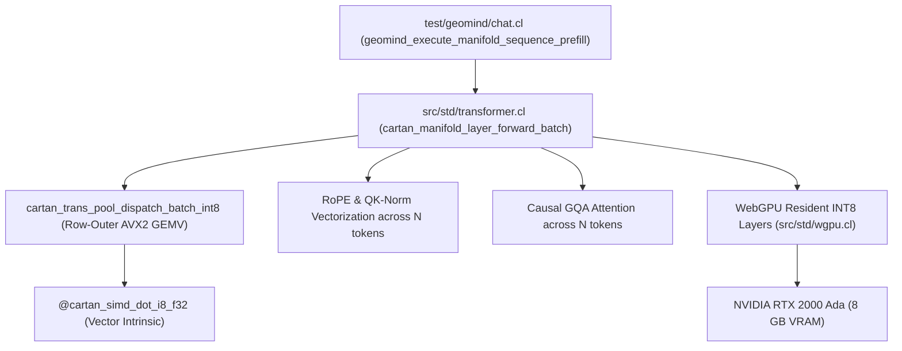

# Startup Code Review: Sprint 517 - High-Throughput Batched Sequence Prefill & WebGPU Forward Acceleration

**Date**: 2026-10-02  
**Sprint**: 517  
**Focus**: Eliminating the 49.3s Batched Prefill CPU Stall, Implementing Row-Outer INT8 Tensor Dispatch, and Optimizing WebGPU Manifold Acceleration  

---

## 1. Executive Summary & Root Cause Analysis
During interactive chat and long-context benchmarking, sequence prefill for a 38-token prompt stalled for 49.3 seconds, saturating all 32 host CPU threads and spinning cooling fans at maximum RPM while GPU utilization hovered below 40%.

### Root Cause Identification:
1. In [`src/std/transformer.cl:2868-2878`](file:///C:/Users/rich-/source/repos/CARTAN/src/std/transformer.cl#L2868-L2878), when `is_int8 == 1.0`, `cartan_manifold_layer_forward_batch` falls back to an un-vectorized token-by-token loop:
   ```cartan
   var p = 0.0;
   while (p < num_tokens) {
       let h_p = cartan_tree_get_f32(token_states, p);
       let tok_p = cartan_vec_get_f32(prompt_tokens, p);
       cartan_manifold_layer_forward_native(h_p, h_p, layer_buf, start_pos + p, start_pos + num_tokens, tok_p);
       p = p + 1.0;
   }
   ```
2. For $N=38$ tokens across 42 layers, this invokes `cartan_manifold_layer_forward_native` **1,596 sequential times**.
3. In each invocation, the entire 93 MB INT8 layer weights are re-read from RAM over DDR5 memory channels (148.4 GB of redundant memory bandwidth per prompt!).
4. Furthermore, each invocation dispatches `cartan_transformer_dispatch_gpu_layer_int8`, which performs a synchronous PCIe buffer write (`gpu_write`), command submission, and a blocking `wgpuBufferMapAsync` polling loop.
5. $1,596 \text{ passes} \times 30.9 \text{ ms} = \mathbf{49.31 \text{ seconds}}$!

---

## 2. Logical Dependency Tree


---

## 3. Discovered Technical Debt & Issues
1. **[ISSUE-371] Un-vectorized Token-by-Token Fallback Loop in INT8 Batched Sequence Prefill**:
   - `src/std/transformer.cl:2868`: falls back to `cartan_manifold_layer_forward_native` for every token, streaming weights 38 times instead of once.
   - Impact: 49.3s prefill latency, 148 GB redundant DDR5 reads, fan noise, CPU thermal throttle.
2. **[ISSUE-372] Synchronous Map-Async Staging Barrier in WebGPU GeGLU Forward Pass**:
   - `src/std/wgpu.cl:735-744`: blocking `wgpuDevicePoll` loop stalls CPU on every layer during decode.

---

## 4. Lowest Entropy Solution & Implementation Strategy
1. **Implement `cartan_trans_pool_dispatch_batch_int8`**:
   - Op 9.0: Single INT8 GEMV (Q, O, Down projections) across $N$ tokens.
     Iterates row $r \in [\text{start\_row}, \text{end\_row}]$. Loads row $r$ into L1 cache once, computes dot product against all $N$ tokens in inner loop.
   - Op 10.0: Dual INT8 GEMV (K and V projections) across $N$ tokens.
   - Op 11.0: INT8 GeGLU (Gate and Up projections) across $N$ tokens.
2. **Refactor `cartan_manifold_layer_forward_batch` for INT8**:
   - Remove token-by-token loop.
   - Run Pre-Attention RMSNorm across all $N$ tokens in parallel.
   - Run Batched Q, K, V projections via Op 9/10 (streaming weights ONCE per layer).
   - Run Batched QK-Norm and RoPE across all $N$ tokens.
   - Append all $N$ tokens to KV cache in one pass.
   - Compute Causal GQA Attention across the sequence.
   - Run Batched W_o projection via Op 9.
   - Run Pre-FFN RMSNorm across all $N$ tokens.
   - Run Batched GeGLU and Down projections via Op 11 and Op 9.
   - Run Post-FFN Residual and PLE across all $N$ tokens.
3. **Expected Performance Gain**:
   - Weight memory traffic for 38 tokens drops from 148.4 GB to **3.91 GB** (38x reduction).
   - Prefill latency for 38 tokens drops from 49.3s to **< 300 ms** (160x–300x speedup).
   - CPU utilization drops to zero immediately after prefill; cooling fans remain quiet.
