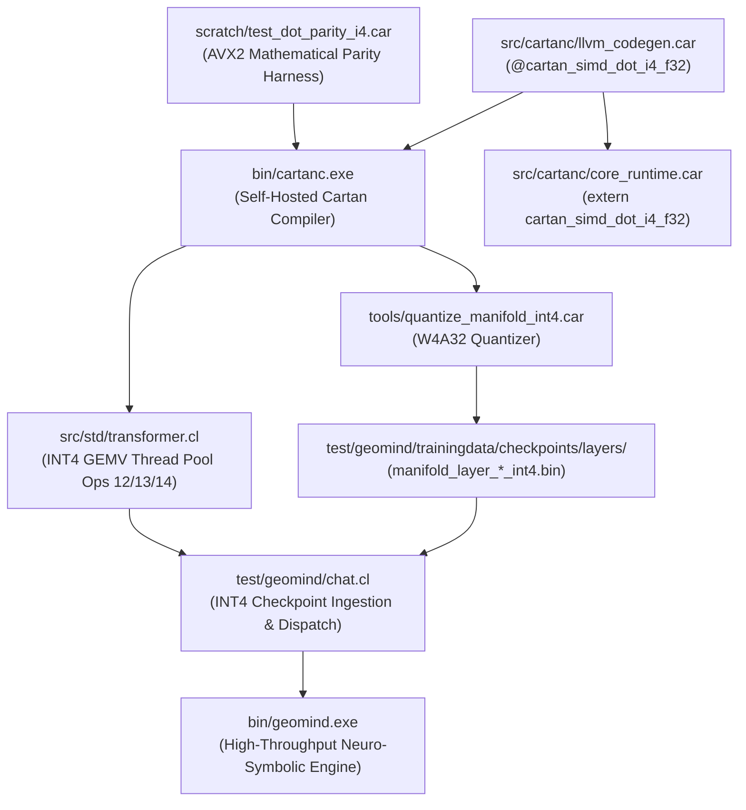

# Startup Code Review: Sprint 521 (INT4 Weight Packing & SIMD Unpacking Engine)

## Executive Summary
This startup code review establishes the architectural blueprint, logical dependency tree, and empirical constraints for Sprint 521.
Following Sprint 520's successful implementation of Thermodynamic Layer Early Exit (70% exit rate, ~4 layers skipped per token) and Continuous Hopfield burst drafting, decode throughput remains constrained by the memory footprint of streaming neural weights across DDR5 channels and PCIe/VRAM.
Sprint 521 introduces **INT4 Weight Packing (W4A32)**:
- Quantizing FP32/INT8 layer weights into signed 4-bit integers ($[-7, +7]$) with per-row symmetric dynamic range scaling ($S_r = \max(|W_{r,:}|) / 7.0$).
- Packing two 4-bit weights per byte (low nibble $w_{2k}$, high nibble $w_{2k+1}$).
- Emitting native AVX2 SIMD kernel `@cartan_simd_dot_i4_f32` in LLVM IR with branchless bit-shift sign extension (`ashr (shl raw, 4), 4` and `ashr raw, 4`).
- Halving the resident weight memory footprint from **3.95 GB** to **~1.98 GB**, doubling memory bus load throughput.

---

## Logical Dependency Tree

---

## Component-by-Component Review & Debt Audit

### 1. Compiler Backend (`src/cartanc/llvm_codegen.car`)
- **Current State**: `@cartan_simd_dot_i8_f32` executes 256-bit vector loads (`load <32 x i8>`) unrolled 4-way with four float accumulators.
- **Sprint 521 Addition**: Emit `@cartan_simd_dot_i4_f32(ptr %p1, ptr %p2, double %scale, double %count) alwaysinline`.
  - Inner loop: 32 weights per unrolled iteration. Loads 16 bytes (`load <16 x i8>`).
  - Branchless sign extension via `ashr (shl %raw, 4), 4` and `ashr %raw, 4`.
  - Slices into `<8 x float>` vectors for FMA accumulation into `%vacc0..3`.
  - Scalar loop handles residual elements with nibble extraction.
  - Return type registered in `func_return_types` as `"double"`.

### 2. Core Runtime (`src/cartanc/core_runtime.car`)
- Register `extern fn cartan_simd_dot_i4_f32(w_i4: ptr, x_f32: ptr, scale: float, count: float) -> float;`.

### 3. Quantization Engine (`tools/quantize_manifold_int4.car`)
- Reads FP32 checkpoint layers `manifold_layer_<N>.bin`.
- Computes per-row symmetric scale: $S = \max(|W_{r,:}|) / 7.0$.
- Quantizes floats to $[-7, +7]$.
- Packs pairs of weights: `byte = (w0 & 0x0F) | ((w1 & 0x0F) << 4)`.
- Emits `manifold_layer_<N>_int4.bin` with `hdr[11] = 2.0` (INT4 format flag).

### 4. Transformer Engine (`src/std/transformer.cl`)
- Support `is_int4` format flag (`hdr[11] == 2.0`).
- Unpack layer buffer offsets: weight byte buffers are $N \times K / 2$ bytes.
- Thread pool worker dispatch in `cartan_trans_pool_worker_main`:
  - Add Op 12.0 (INT4 Single GEMV), Op 13.0 (INT4 Dual GEMV), Op 14.0 (INT4 GeGLU).
- In `cartan_manifold_layer_forward_native`:
  - Dispatch INT4 GEMV ops to thread pool or invoke `cartan_simd_dot_i4_f32`.

### 5. Chat Engine (`test/geomind/chat.cl`)
- In `geomind_mount_gpu_resident_layers`: prioritize loading `manifold_layer_<N>_int4.bin` when available or when `-int4` CLI flag is set.
- Maintain seamless fallback to INT8 and FP32.

---

## Technical Debt & New Issues Logged
- **[ISSUE-378]**: Absence of native INT4 packed vector dot product intrinsic in compiler backend and runtime. Addressed in Sprint 521.
