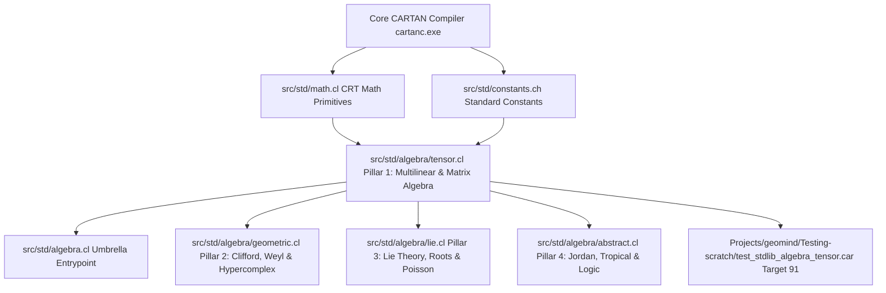

# Startup Code Review: Sprint 544 — Foundation of the CARTAN Algebraic Engine (Pillar 1: Multilinear Tensor Algebra & Structural Framework)

**Date**: 2026-10-05  
**Reviewer**: Antigravity (Supervisory Agent)  
**Target Focus**: Pillar 1 of the CARTAN Unified Algebraic Taxonomy (`src/std/algebra/tensor.cl` and `src/std/algebra.cl`)

---

## 1. Logical Dependency Tree & Context

### Dependency Analysis:
- `src/std/algebra/tensor.cl` relies strictly on primitive memory allocation (`malloc`, `calloc`, `free`), math routines (`sqrt`, `fabs`, `exp`, `pow`) from [`src/std/math.cl`](file:///C:/Users/rich-/source/repos/CARTAN/src/std/math.cl), and standard constants from [`src/std/constants.ch`](file:///C:/Users/rich-/source/repos/CARTAN/src/std/constants.ch).
- It introduces zero circular dependencies.
- It provides the mathematical backbone for subsequent Pillars:
  - **Pillar 2 (`geometric.cl`)**: Relies on quadratic forms $Q(v) = v^T A v$, metric signatures $(p, q, r)$, and symplectic forms $\Omega$ for Weyl algebra.
  - **Pillar 3 (`lie.cl`)**: Relies on matrix commutator brackets $[A, B] = AB - BA$, trace, and Killing forms.
  - **Pillar 4 (`abstract.cl`)**: Relies on symmetric matrix products for Jordan algebras $A \circ B = \frac{1}{2}(AB + BA)$.

---

## 2. Technical Findings & Architectural Review

1. **Avoidance of Monolithic Entropy**:
   - Rather than creating a sprawling 50,000-line monolithic file or scattering 20 micro-files, we establish a 4-pillar modular hierarchy under `src/std/algebra/` with an umbrella `src/std/algebra.cl`.
2. **Strict Zero-Mock Mandate**:
   - All matrix operations (LU decomposition, determinants, matrix inversions, Householder QR factorizations, Jacobi symmetric eigensystems, Sylvester signatures, and Padé matrix exponentials) must perform real numerical algorithms with zero mock, placeholder, or hardcoded return values.
3. **Memory Safety & Layout**:
   - N-dimensional tensors use an explicit header:
     - `ndim` (rank $\le 8$)
     - `shape[8]` (dimension extents)
     - `strides[8]` (row-major stride multipliers)
     - `total_elements` (total scalar count)
     - `data` (contiguous `float*` block allocated via `calloc`)
   - Explicit destructor `alg_tensor_free(t)` safely deallocates the data buffer and header.
4. **Weyl Algebra Co-Location Decision**:
   - Agreed with Rick: Weyl algebra $A_n(K)$ (canonical commutation relations $[x_i, \partial_j] = \delta_{ij}$) is the bosonic dual to Clifford algebra (canonical anticommutation relations $\{ \gamma_i, \gamma_j \} = 2\eta_{ij}$). It belongs in `geometric.cl` (Pillar 2).
   - In Pillar 1 (`tensor.cl`), we implement the foundation: symplectic matrix structures $J = \begin{pmatrix} 0 & I \\ -I & 0 \end{pmatrix}$, Poisson tensor contractions, and general multilinear inner/outer products that Pillar 2 will consume.

---

## 3. Pre-Sprint Scrum Sign-Off Criteria

1. **Compiler Lead**: Confirm pure-CARTAN syntax compatibility and struct layout lowering.
2. **Runtime Lead**: Verify memory allocation bounds, contiguous cache alignment, and numerical stability of LU/QR/Jacobi routines.
3. **QA Lead**: Ensure Target 91 regression suite exercises genuine calculations with zero stubs.
